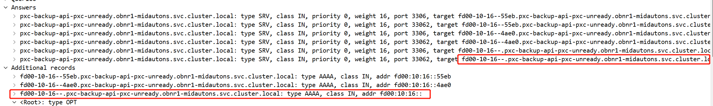

---
kind:
  - Troubleshooting
products:
  - Alauda Container Platform
  - Alauda DevOps
  - Alauda AI
  - Alauda Application Services
  - Alauda Service Mesh
  - Alauda Developer Portal
ProductsVersion:
  - 4.1.0,4.2.x
---
<!-- A type of document that involves encountering a fault, diagnosing it, performing root cause analysis, and providing solutions. -->

# IPv6 集群 SRV 域名解析报错

应用域名解析报错 DNS response contained records which contain invalid names 抓包显示 SRV 类型请求响应包含非法域名 CoreDNS 自动构造的 endpoint 域名格式不符合规范（IPv6 地址转换后含非法字符）

## Cause
- CoreDNS 根据 endpoint IP 自动生成域名时，IPv6 地址经冒号转短横线处理后产生非法域名
- 默认 endpoint 命名策略在未设置 hostname 时使用 IP 地址转换格式

## Resolution
- 在 CoreDNS 的 kubernetes 插件配置中添加 endpoint_pod_names 指令
- 修改后的 CoreDNS 配置示例：
kubernetes cluster.local in-addr.arpa ip6.arpa {
    pods insecure
    endpoint_pod_names
    fallthrough in-addr.arpa ip6.arpa
    ttl 30
}

## [workaround]

## [Related Information]
**Screenshots**

- CoreDNS kubernetes 插件
- k8s endpoint
- SRV 记录
- endpoint_pod_names 配置参数
- Component: CoreDNS
- Page ID: 258474581
- Original Title: IPv6 集群 SRV 域名解析报错
