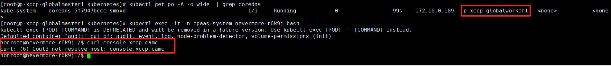
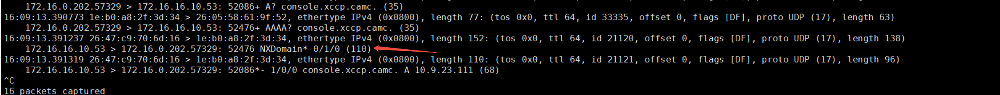
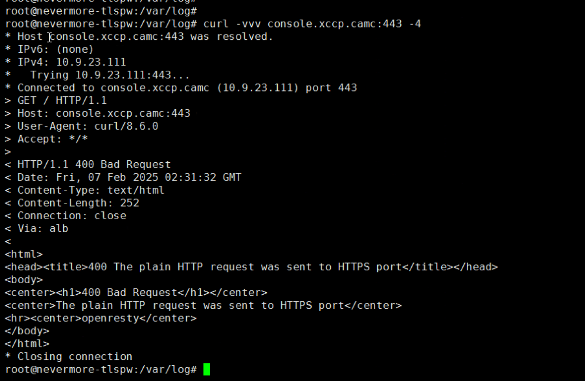
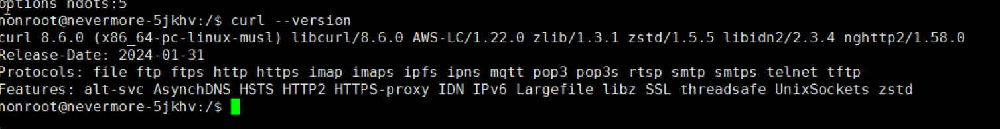

---
kind:
  - Troubleshooting
products:
  - Alauda Container Platform
  - Alauda DevOps
  - Alauda AI
  - Alauda Application Services
  - Alauda Service Mesh
  - Alauda Developer Portal
ProductsVersion:
  - 4.1.0,4.2.x
---
<!-- A type of document that involves encountering a fault, diagnosing it, performing root cause analysis, and providing solutions. -->

# 集群中某些pod curl 域名解析失败报错 Could not resolve host

pod curl 域名解析失败报错 Could not resolve host

## Cause
- curl 早期版本存在bug
- musl 兼容性问题导致IPv6解析异常

## Resolution
- 在curl命令中添加-4参数强制使用IPv4解析

## [workaround]

## [Related Information]
**Screenshots**

- Environment: 操作系统：麒麟；内核：kylin sp2；CNI版本：1.12.26
- coredns
- kube-ovn-pinger
- curl
- musl
- IPv4解析参数(-4)
- Component: CoreDNS
- Page ID: 262472716
- Original Title: 集群中某些pod curl 域名解析失败报错 Could not resolve host
