---
kind:
  - Troubleshooting
products:
  - Alauda Container Platform
  - Alauda DevOps
  - Alauda AI
  - Alauda Application Services
  - Alauda Service Mesh
  - Alauda Developer Portal
ProductsVersion:
  - 4.1.0,4.2.x
---
<!-- A type of document that involves encountering a fault, diagnosing it, performing root cause analysis, and providing solutions. -->

# 麒麟系统 DNS 域名解析故障

Pod 无法正常解析域名 CoreDNS 回包未正确 SNAT conntrack -S 显示较多错误统计

## Cause
- 内核版本 4.19.90-52.22.v2207.ky10.x86_64 存在缺陷
- 海光 CPU 可能存在兼容性问题
- upcall 相关任务卡死导致流表更新异常

## Resolution
- 升级内核到 kernel-4.19.90-52.44.v2207.ky10 或更高版本

## [workaround]
- 执行命令: nsenter -a -t `pidof -s kube-ovn-daemon` ovs-appctl revalidator/wait

## [Related Information]
**Screenshots**
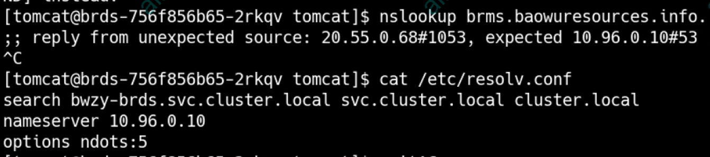
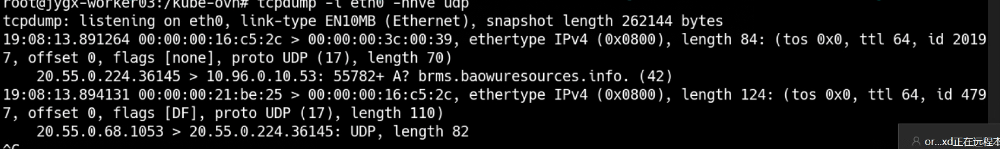
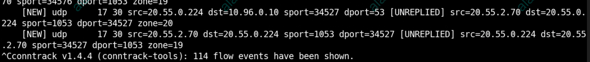
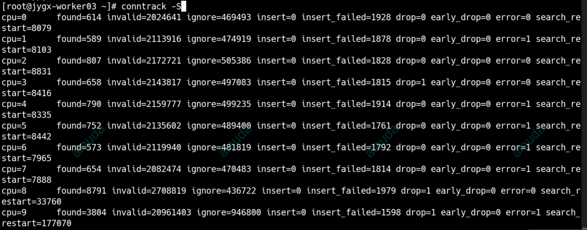
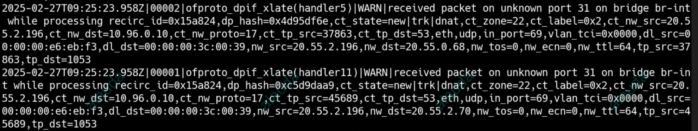
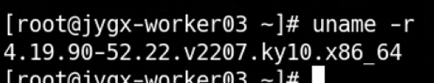
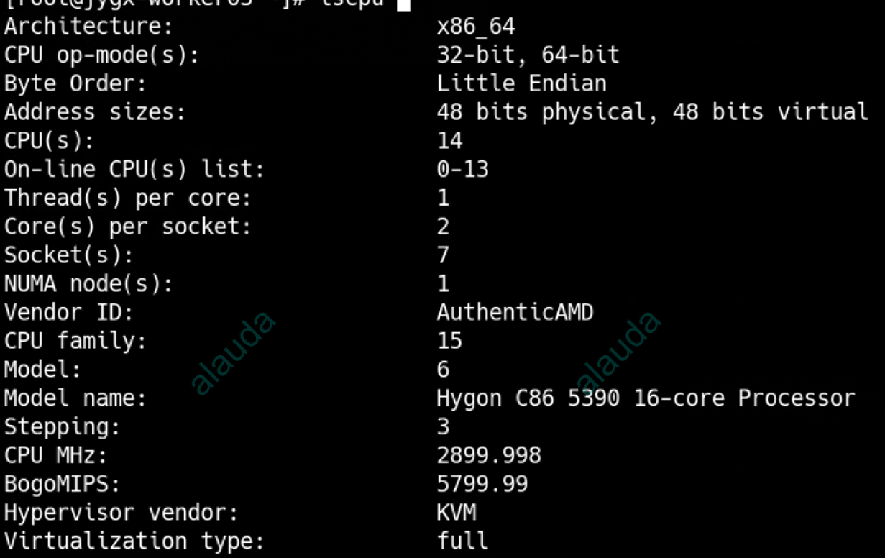
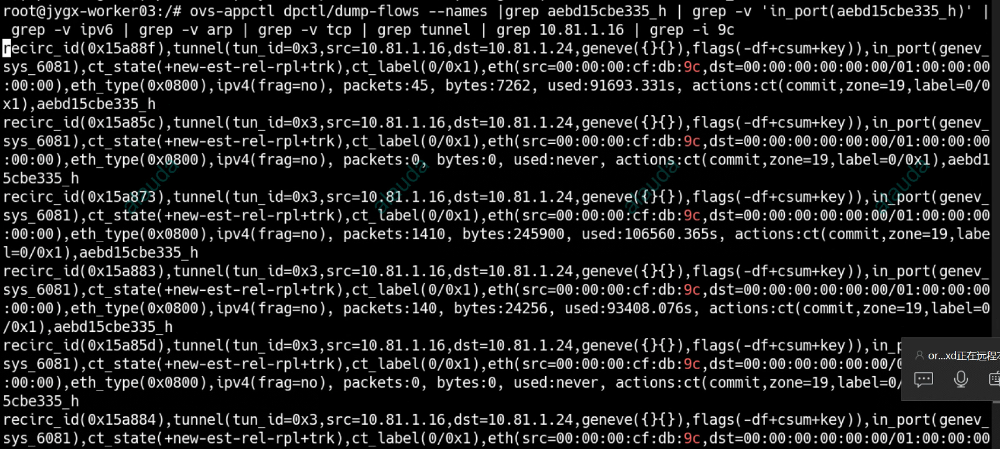
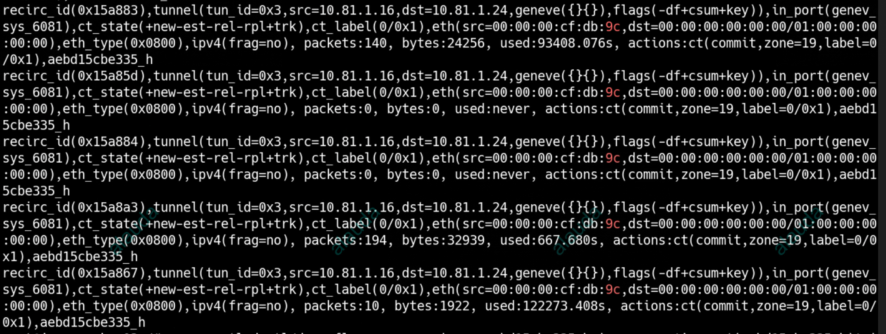
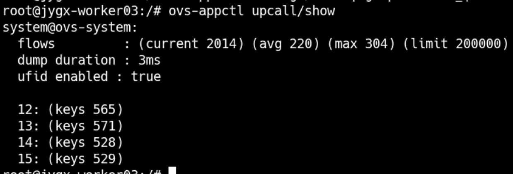
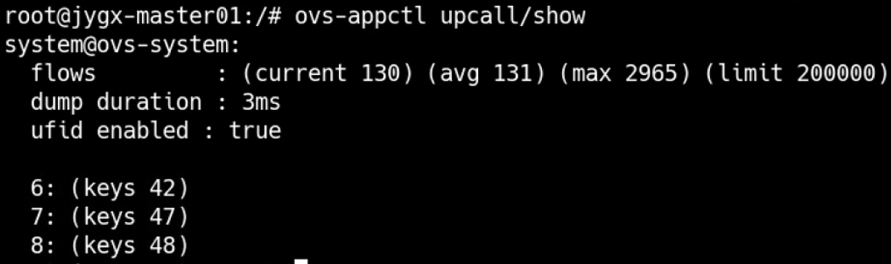
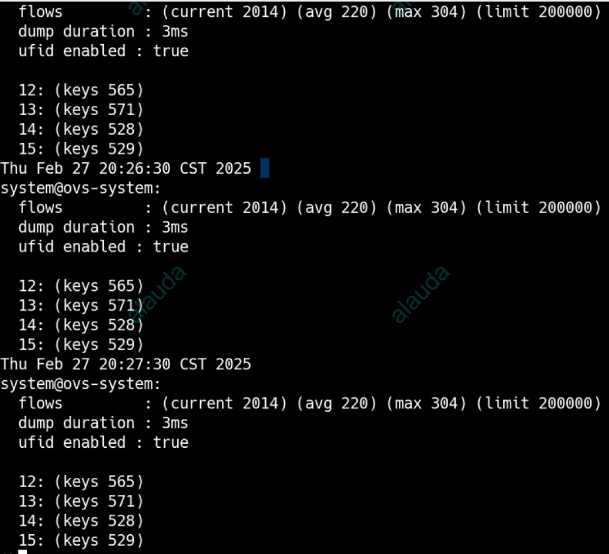
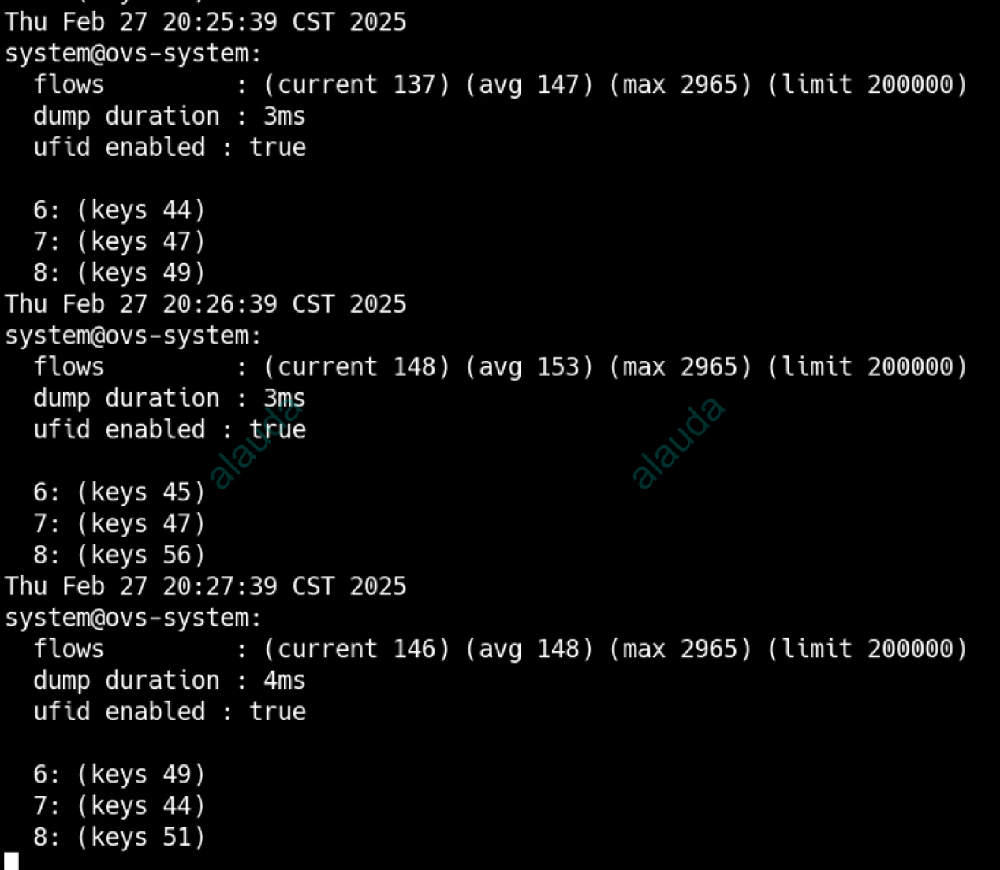
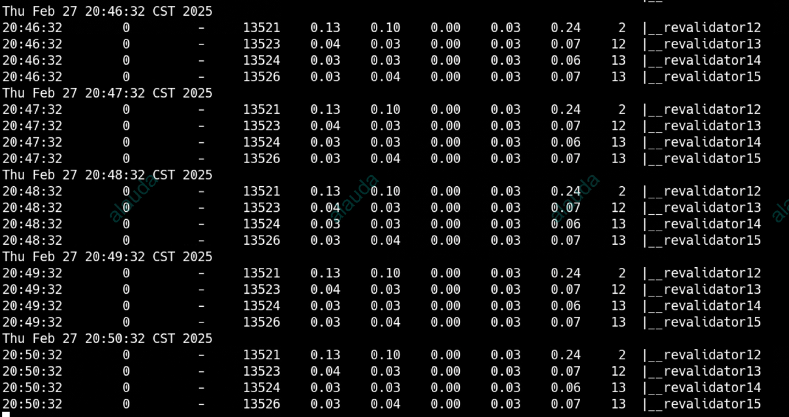
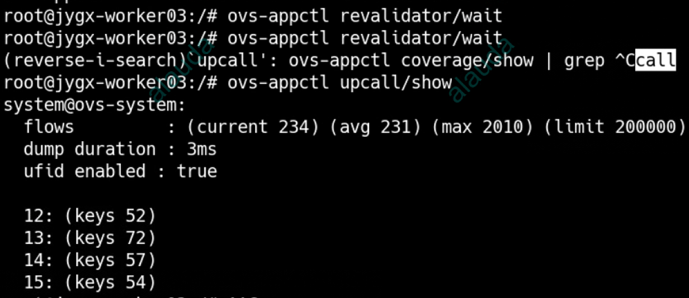
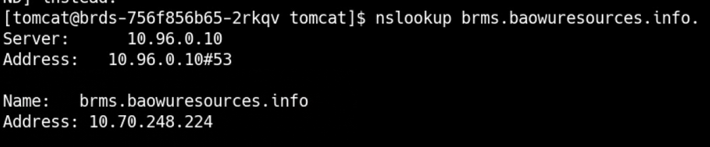
- Environment: 国产海光 CPU
- CoreDNS
- conntrack
- vswitchd
- ovs-ovn
- datapath 流表
- upcall 配置
- 海光 CPU
- 4.19.90-52.22.v2207.ky10.x86_64 内核
- Component: CoreDNS
- Page ID: 268009939
- Original Title: 麒麟系统 DNS 域名解析故障
