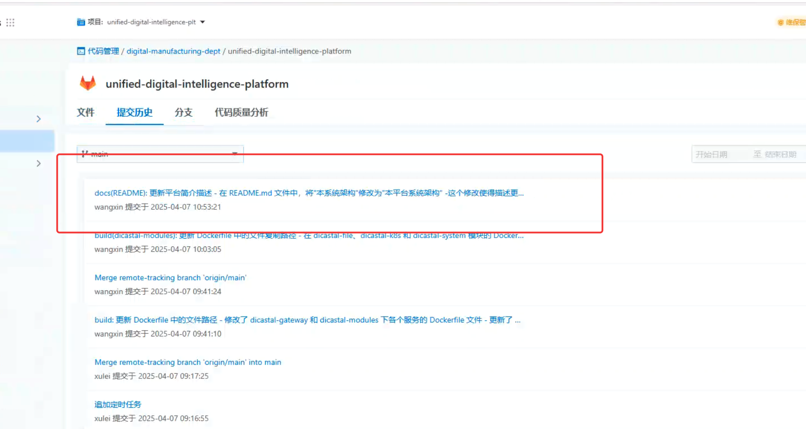

---kind:   - Troubleshootingproducts:    - Alauda Container Platform   - Alauda DevOps   - Alauda AI   - Alauda Application Services   - Alauda Service Mesh   - Alauda Developer PortalProductsVersion:   - 4.1.0,4.2.x---<!-- A type of document that involves encountering a fault, diag...it, performing root cause analysis, and providing solutions. --># DevOps使用问题Git提交代码后未触发流水线## Cause- Git服务器缺少DNS解析## Resolution- 在Git服务器配置hosts文件添加DNS解析记录## [workaround]## [Related Information]**Screenshots**- Environment: Version 3.18- Git server- hosts文件- DNS配置- 流水线触发器- Component: CoreDNS- Page ID: 274694739- Original Title: Devops-DevOps使用问题-104947