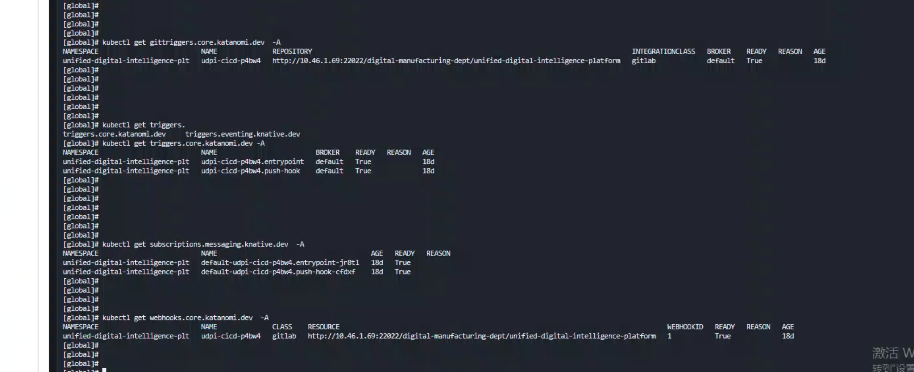

---
kind:
  - Troubleshooting
products:
  - Alauda Container Platform
  - Alauda DevOps
  - Alauda AI
  - Alauda Application Services
  - Alauda Service Mesh
  - Alauda Developer Portal
ProductsVersion:
  - 4.1.0,4.2.x
---
<!-- A type of document that involves encountering a fault, diagnosing it, performing root cause analysis, and providing solutions. -->

# DevOps使用问题

Git提交代码后，未触发流水线

## Cause
- git的服务器没有DNS解析

## Resolution
- 在服务器上添加git服务器的hosts记录

## [workaround]

## [Related Information]
**Screenshots**

- Environment: 3.18
- git服务器
- 流水线触发配置
- /etc/hosts
- Component: CoreDNS
- Page ID: 274694739
- Original Title: Devops-DevOps使用问题-104947
