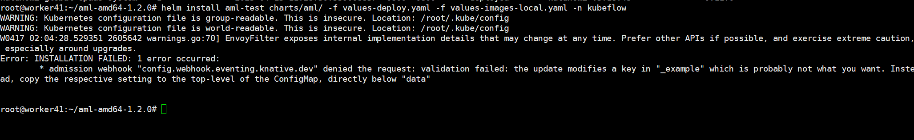
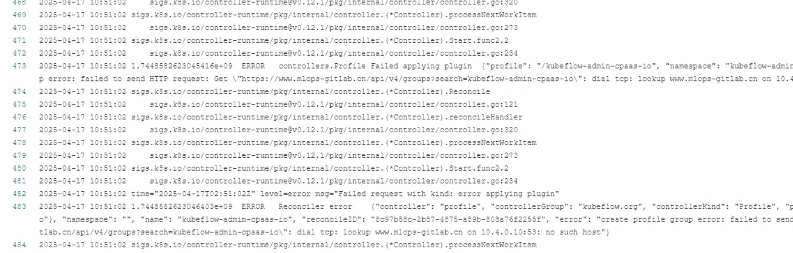
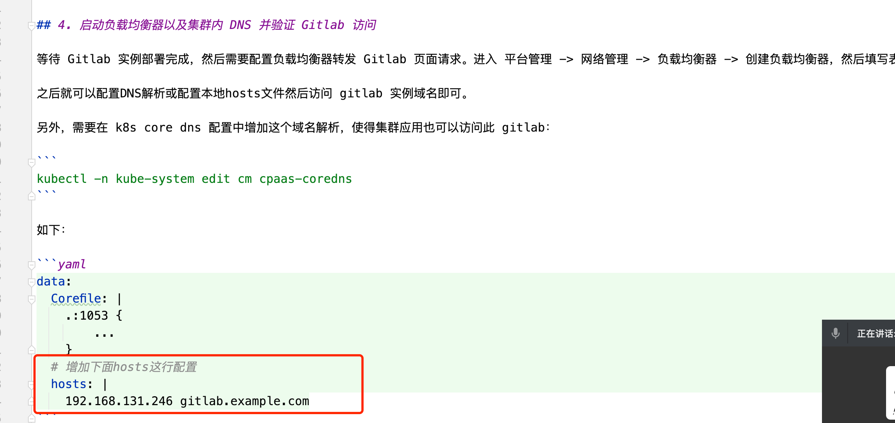
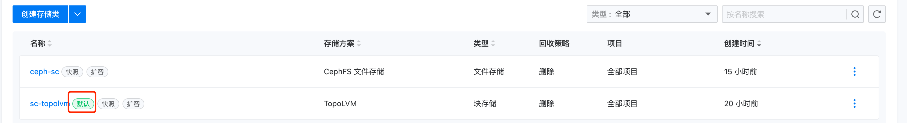

---
kind:
  - Troubleshooting
products:
  - Alauda Container Platform
  - Alauda DevOps
  - Alauda AI
  - Alauda Application Services
  - Alauda Service Mesh
  - Alauda Developer Portal
ProductsVersion:
  - 4.1.0,4.2.x
---
<!-- A type of document that involves encountering a fault, diagnosing it, performing root cause analysis, and providing solutions. -->

# aml 部署问题

devops kn冲突 profiles-deployment 报错 gitlab 连不上 高级功能没有做任何跳转

## Cause
- devops 的 knative-operator 实例冲突
- coredns 未正确配置导致 gitlab 解析失败
- centraldashboard-config configmap 地址未添加 https:// schema
- 网关 nodeport 被占用或网关 pod 标签错误
- 集群缺少默认存储类

## Resolution
- 卸载 devops 的 knative-operator 并删除实例
- 配置 coredns 解析记录
- 在 centraldashboard-config 地址中添加 https:// schema
- 更换 nodeport 或修正网关 pod 标签
- 为集群配置默认存储类

## [workaround]

## [Related Information]
**Screenshots**

- Environment: Kubernetes 集群环境，涉及 Knative、Istio、GitLab 集成及存储类配置
- knative-operator
- coredns
- centraldashboard-config
- asm-controller
- envoyfilter(authn-filter)
- kubeflow-gateway
- pvc
- Component: CoreDNS
- Page ID: 277807351
- Original Title: aml 部署问题
