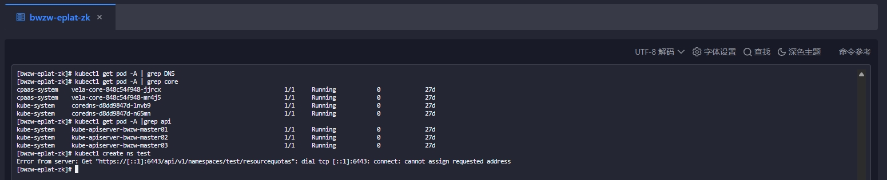
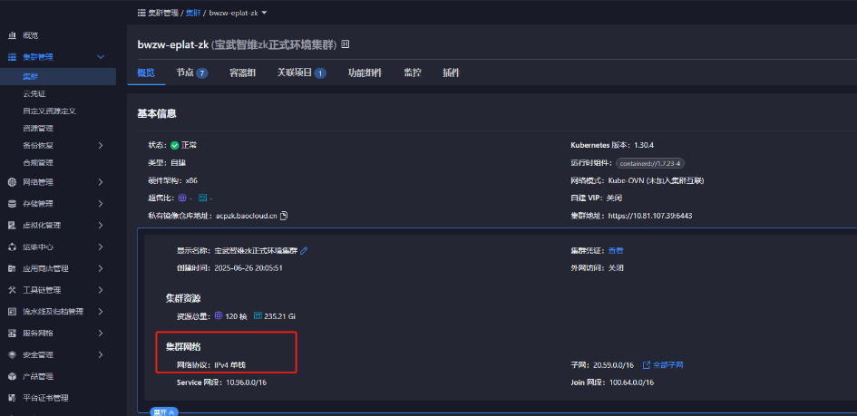
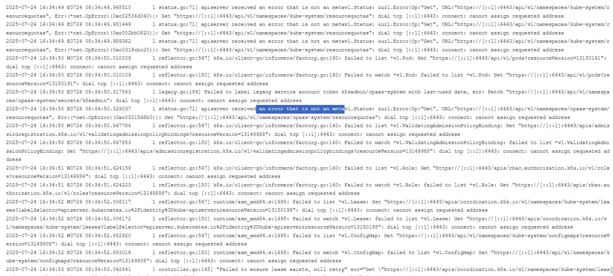
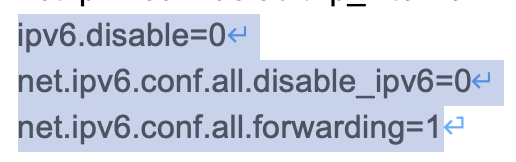

---
kind:
  - Troubleshooting
products:
  - Alauda Container Platform
  - Alauda DevOps
  - Alauda AI
  - Alauda Application Services
  - Alauda Service Mesh
  - Alauda Developer Portal
ProductsVersion:
  - 4.1.0,4.2.x
---
<!-- A type of document that involves encountering a fault, diagnosing it, performing root cause analysis, and providing solutions. -->

# acpzk环境的集群bwzw

创建命名空间失败 报错显示通过IPv6环回地址[::1]连接apiserver coreDNS部署失败但集群pod处于running状态

## Cause
- sysctl.conf文件中存在多余的IPv6配置
- 单栈IPv4集群错误尝试使用IPv6环回地址连接apiserver

## Resolution
- 删除三个master节点sysctl.conf中多余的IPv6配置
- 将sysctl.conf内容与标准部署文档中的IPv6配置对齐

## [workaround]

## [Related Information]
**Screenshots**

- Environment: 版本3.18.1 | 集群bwzw-eplat-zk | 单栈IPv4网络
- apiserver
- sysctl.conf
- net.ipv6.conf.all.disable_ipv6
- net.ipv6.conf.default.disable_ipv6
- net.ipv6.conf.lo.disable_ipv6
- Component: CoreDNS
- Page ID: 324174110
- Original Title: 基础架构-产品生命周期管理-部署-acpzk环境的集群bwzw-eplat-zk集群创建命名空间报错-113674
