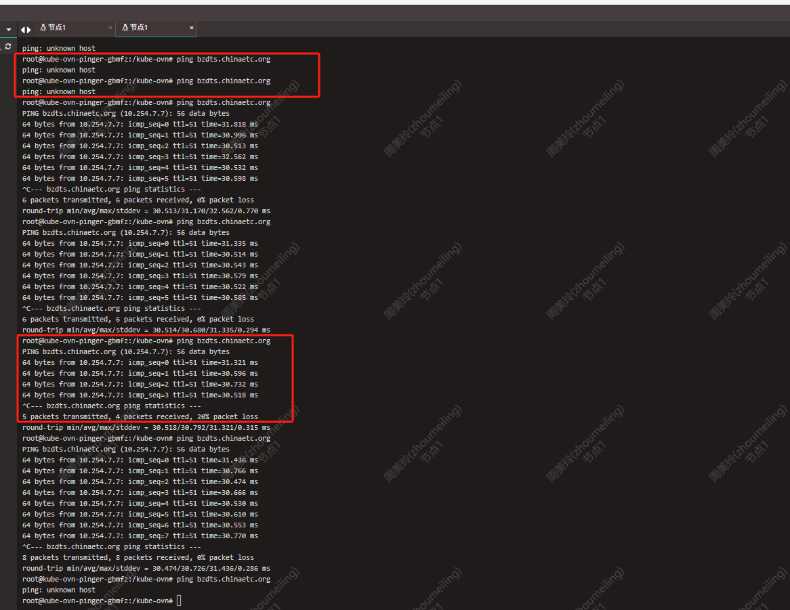
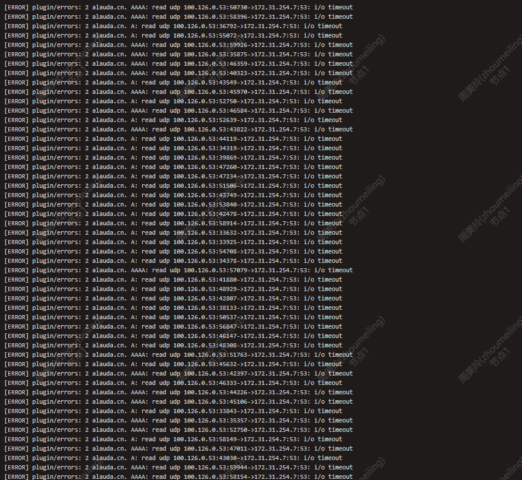
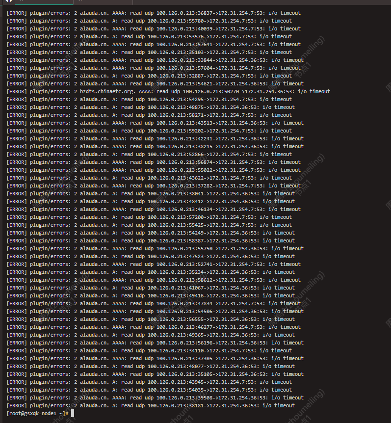

---kind:   - Troubleshootingproducts:    - Alauda Container Platform   - Alauda DevOps   - Alauda AI   - Alauda Application Services   - Alauda Service Mesh   - Alauda Developer PortalProductsVersion:   - 4.1.0,4.2.x---<!-- A type of document that involves encountering a fault, diag...it, performing root cause analysis, and providing solutions. --># 甘肃响泉口三个节点修改dns服务指向后，集群服务访问业务域名偶尔正常偶尔失败的现象集群服务访问业务域名偶尔正常偶尔失败 cordns存在相关超时报错## Cause- coredns中存在缓存## Resolution- 重启coredns## [workaround]## [Related Information]**Screenshots**- Environment: RE-3.12.2- coredns- Component: CoreDNS- Page ID: 327267921- Original Title: 基础架构-产品组件-甘肃响泉口三个节点修改dns服务指向后，集群服务访问业务域名偶尔正常偶尔失败的现象-113062