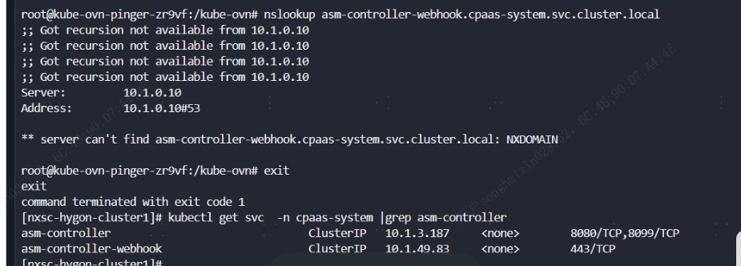

---kind:   - Troubleshootingproducts:    - Alauda Container Platform   - Alauda DevOps   - Alauda AI   - Alauda Application Services   - Alauda Service Mesh   - Alauda Developer PortalProductsVersion:   - 4.1.0,4.2.x---<!-- A type of document that involves encountering a fault, diag...it, performing root cause analysis, and providing solutions. --># 创建网关的时候报错无法连接asm controller的svc地址创建网关时报错无法连接asm controller的svc地址 容器内nslookup解析svc域名报错找不到路由## Cause- kube-proxy组件日志异常且未刷新日志- kube-proxy无法维护K8s集群路由## Resolution- 重启所有节点kube-proxy组件- 重新创建网关验证功能## [workaround]## [Related Information]**Screenshots**- Environment: 3.14.2- asm-controller-webhook.svc- kube-proxy- coredns- svc路由- Component: CoreDNS- Page ID: 330465781- Original Title: 容器平台-网络-创建网关的时候报错无法连接asm controller的svc地址-114709