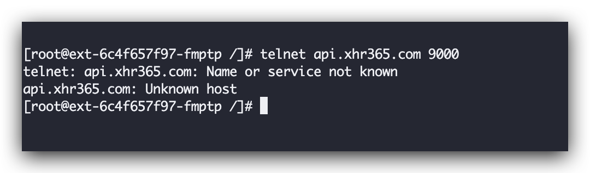
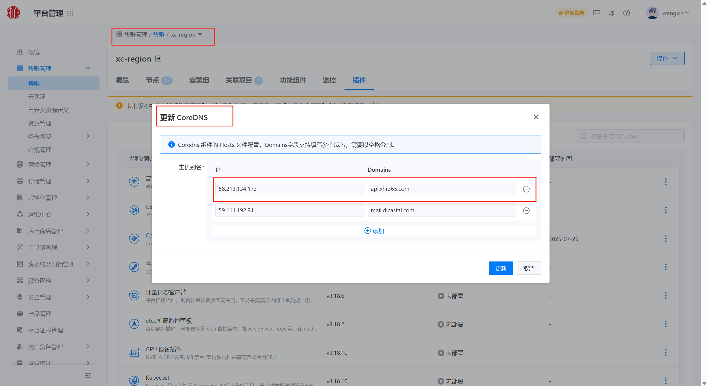
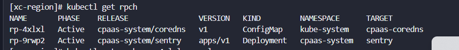
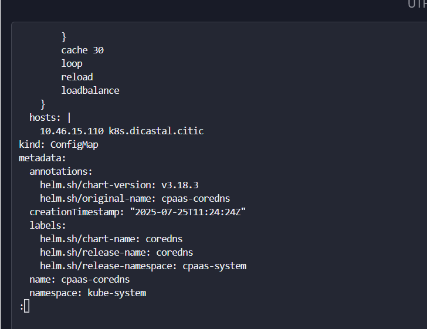

---
kind:
  - Troubleshooting
products:
  - Alauda Container Platform
  - Alauda DevOps
  - Alauda AI
  - Alauda Application Services
  - Alauda Service Mesh
  - Alauda Developer Portal
ProductsVersion:
  - 4.1.0,4.2.x
---
<!-- A type of document that involves encountering a fault, diagnosing it, performing root cause analysis, and providing solutions. -->

# CoreDNS配置不生效

CoreDNS规则在pod内不生效

## Cause
- 后台修改cpaas-coredns ConfigMap导致解析规则无法生效

## Resolution
- 1.删除rpch资源
2.修改coredns插件内的解析配置

## [workaround]

## [Related Information]
**Screenshots**

，导致在coredns插件内添加的解析无法注入
- Environment: 3.18.1
- cpaas-coredns
- rpch资源
- ConfigMap
- Component: CoreDNS
- Page ID: 330465788
- Original Title: 容器平台-网络-CoreDNS配置不生效-114511
