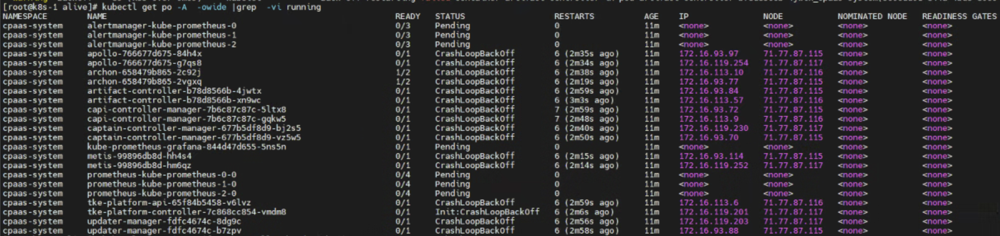
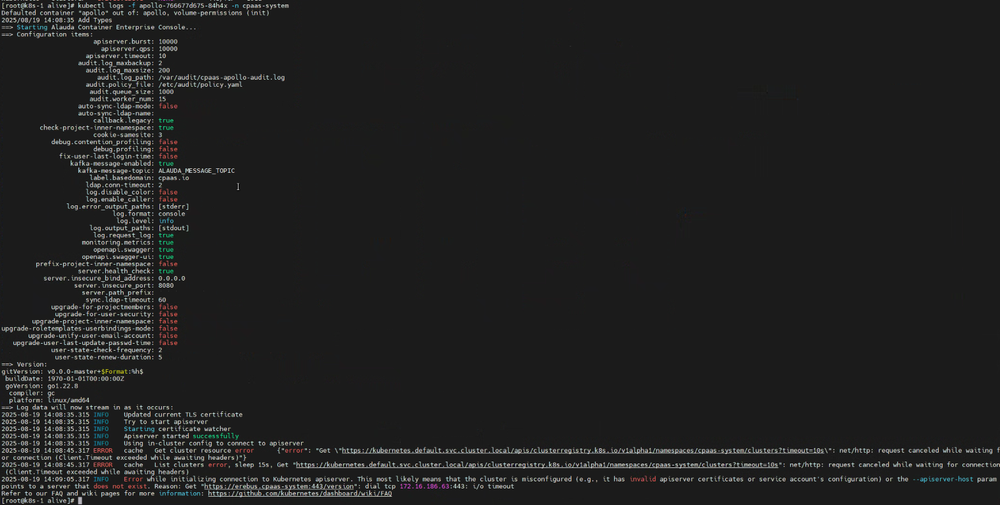
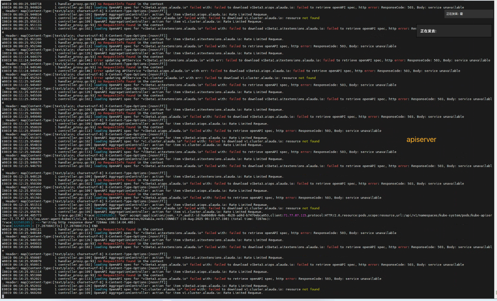
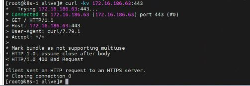
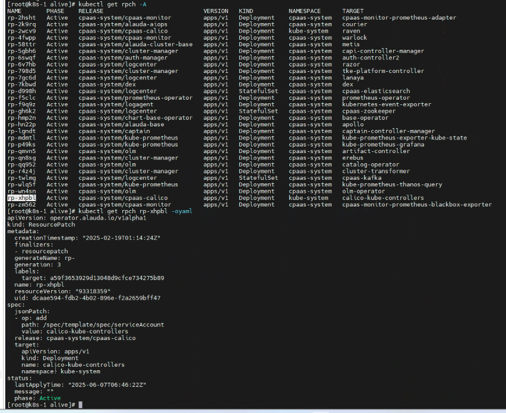
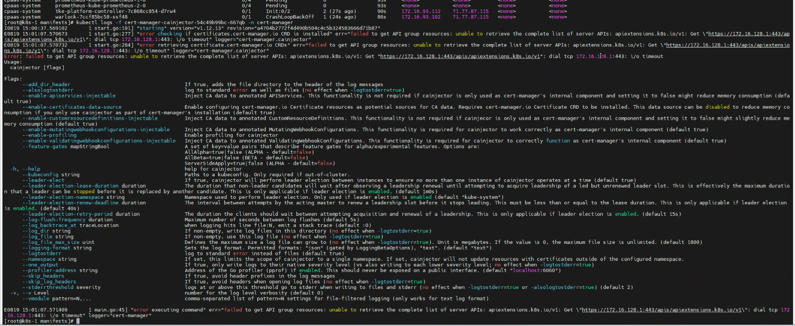
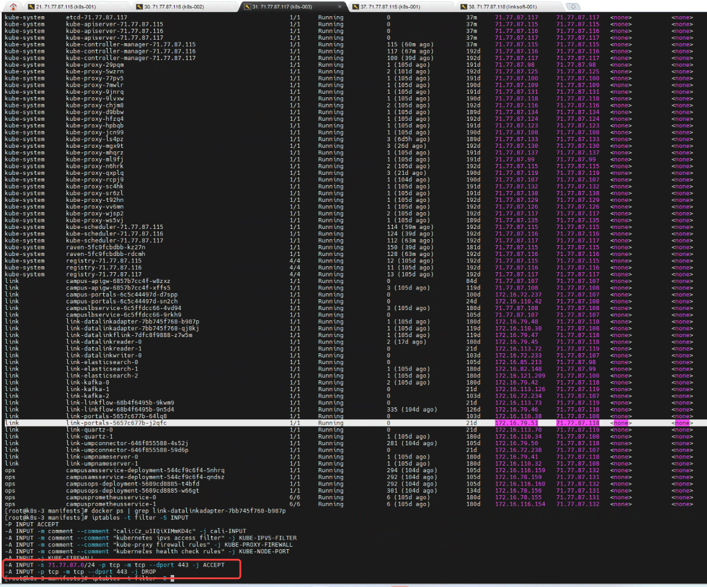

---
kind:
  - Troubleshooting
products:
  - Alauda Container Platform
  - Alauda DevOps
  - Alauda AI
  - Alauda Application Services
  - Alauda Service Mesh
  - Alauda Developer Portal
ProductsVersion:
  - 4.1.0,4.2.x
---
<!-- A type of document that involves encountering a fault, diagnosing it, performing root cause analysis, and providing solutions. -->

# cpaas

cpaas-system命名空间下多个pod处于非running状态 calico-kube-controller和coredns变为0/1 running状态 日志出现dial tcp 172.16.128.1:443 i/o timeout报错

## Cause
- global集群master节点存在iptables规则：iptables -t filter -D INPUT -p tcp -m tcp --dport 443 -j DROP，导致443端口被阻断

## Resolution
- 删除异常iptables规则：iptables -t filter -D INPUT -p tcp -m tcp --dport 443 -j DROP

## [workaround]

## [Related Information]
**Screenshots**

- Environment: 3.16.1-hicampus版本，global集群
- 443端口
- calico-kube-controller
- coredns
- iptables规则
- kube-system命名空间
- Component: CoreDNS
- Page ID: 333316725
- Original Title: 容器平台-网络-cpaas-system命名空间下多个pod非running状态-115540
