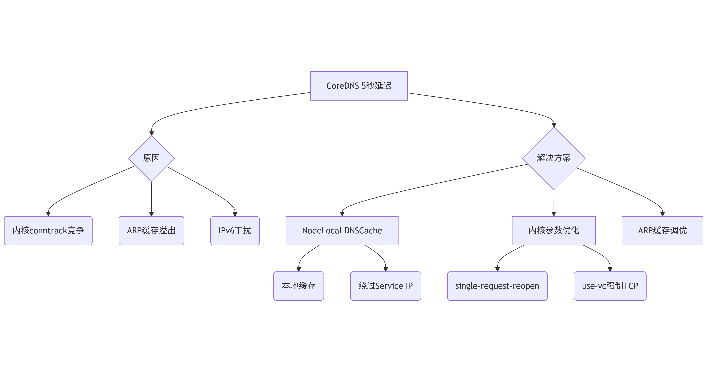

---
kind:
  - Troubleshooting
products:
  - Alauda Container Platform
  - Alauda DevOps
  - Alauda AI
  - Alauda Application Services
  - Alauda Service Mesh
  - Alauda Developer Portal
ProductsVersion:
  - 4.1.0,4.2.x
---
<!-- A type of document that involves encountering a fault, diagnosing it, performing root cause analysis, and providing solutions. -->

# pod内请求内外部域名解析慢问题故障排除

pod内解析域名时部分请求延迟5秒后成功 抓包发现DNS请求未收到响应，5秒后重试成功 dmesg报错：ARP table overflow

## Cause
- 内核conntrack模块并发处理UDP DNS请求时丢弃部分请求
- 宿主机ARP缓存表默认阈值不足导致溢出
- 客户端默认同时请求A和AAAA记录，IPv6不可达触发超时
- CoreDNS随机选择上游DNS服务器导致选到不可用节点

## Resolution
- spec.dnsConfig.options添加use-vc和single-request-reopen
- 修改/proc/sys/net/ipv4/neigh/default/gc_thresh*参数
- CoreDNS ConfigMap添加template ANY AAAA { rcode NXDOMAIN }
- CoreDNS配置forward策略改为sequential
- 部署NodeLocal DNSCache方案

## [workaround]
- echo 8192 > /proc/sys/net/ipv4/neigh/default/gc_thresh1
- echo 16384 > /proc/sys/net/ipv4/neigh/default/gc_thresh2
- echo 32768 > /proc/sys/net/ipv4/neigh/default/gc_thresh3

## [Related Information]
**Screenshots**

- Environment: Kubernetes集群（使用kube-proxy iptables/IPVS模式）
- conntrack
- glibc/musl
- kube-proxy
- CoreDNS
- NodeLocal DNSCache
- /etc/resolv.conf
- dnsConfig.options
- udp/53
- net.ipv4.neigh.default.gc_thresh*
- forward.policy
- Component: CoreDNS
- Page ID: 335413772
- Original Title: pod内请求内外部域名解析慢问题故障排除
