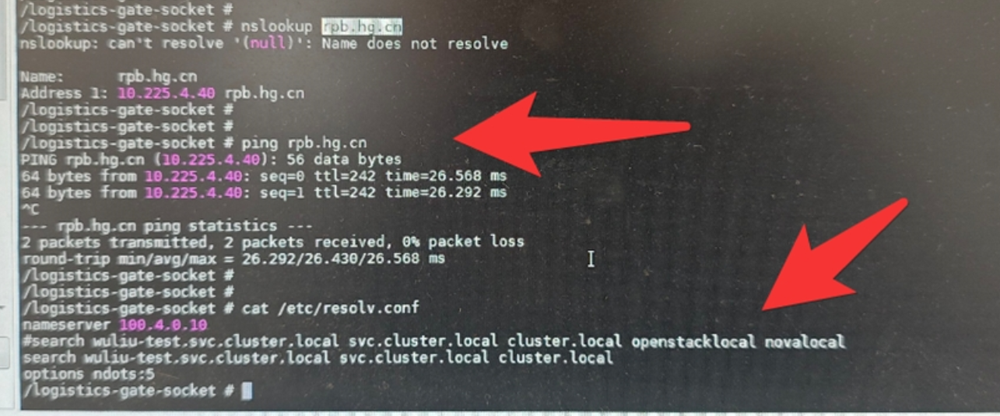

---
kind:
  - Troubleshooting
products:
  - Alauda Container Platform
  - Alauda DevOps
  - Alauda AI
  - Alauda Application Services
  - Alauda Service Mesh
  - Alauda Developer Portal
ProductsVersion:
  - 4.1.0,4.2.x
---
<!-- A type of document that involves encountering a fault, diagnosing it, performing root cause analysis, and providing solutions. -->

# 平台coredns域名解析相关问题（无法正常解析的场景）

页面添加coredns域名解析服务器后不生效 给coredns添加本地静态解析不生效

## Cause
- 本地/etc/resolv.conf存在配置干扰
- 容器内/etc/resolv.conf存在search域影响解析

## Resolution
- 检查本地节点能否正常解析域名
- 测试容器内默认coredns是否生效
- 查看coredns日志排查异常
- edit cpaas-coredns cm配置静态解析
- 注释容器resolv.conf中的search域测试

## [workaround]
- 通过deployment配置host解析替代方案

## [Related Information]
**Screenshots**

- Environment: Kubernetes平台容器环境
- /etc/resolv.conf
- cpaas-coredns ConfigMap
- search域配置
- hosts文件解析
- coredns日志
- Component: CoreDNS
- Page ID: 341705039
- Original Title: 平台coredns域名解析相关问题（无法正常解析的场景）
