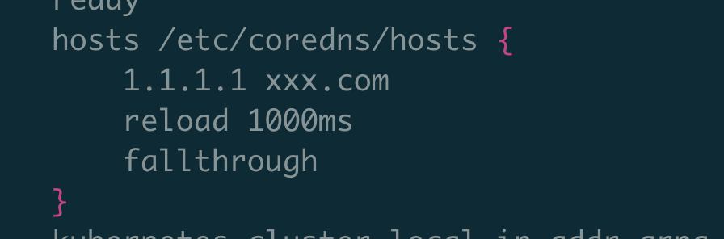
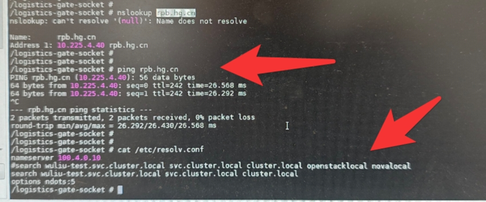

---kind:   - Troubleshootingproducts:    - Alauda Container Platform   - Alauda DevOps   - Alauda AI   - Alauda Application Services   - Alauda Service Mesh   - Alauda Developer PortalProductsVersion:   - 4.1.0,4.2.x---<!-- A type of document that involves encountering a fault, diag...it, performing root cause analysis, and providing solutions. --># 页面添加coredns域名解析条目不生效页面添加coredns域名解析条目不生效 容器/etc/resolv.conf存在openstack相关search配置## Cause- 节点自动生成的resolv.conf包含干扰性search域配置## Resolution## [workaround]- 通过deployment配置hostAliases实现本地解析## [Related Information]**Screenshots**- Environment: 3.14.1- cpaas-coredns ConfigMap- /etc/resolv.conf- search域配置- hostAliases配置- Component: CoreDNS- Page ID: 341705039- Original Title: 容器平台-原生组件-Kubernetes，Docker等原生组件问题-页面添加coredns域名解析条目不生效-116794