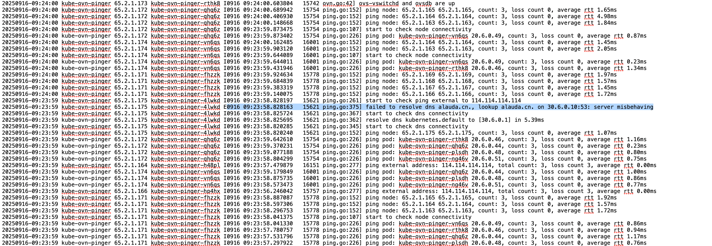
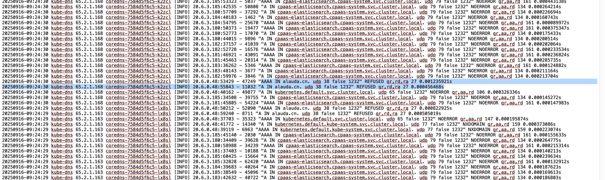

---
kind:
  - Troubleshooting
products:
  - Alauda Container Platform
  - Alauda DevOps
  - Alauda AI
  - Alauda Application Services
  - Alauda Service Mesh
  - Alauda Developer Portal
ProductsVersion:
  - 4.1.0,4.2.x
---
<!-- A type of document that involves encountering a fault, diagnosing it, performing root cause analysis, and providing solutions. -->

# 集群coredns解析错误率超过5%问题排查

coredns解析错误率超过5% 响应码为refused kube-ovn-pinger组件pod发起的查询请求

## Cause
- kube-ovn-pinger组件尝试解析alauda.cn时被拒绝

## Resolution
- 在coredns配置中增加hosts解析：alauda.cn -> 1.1.1.1

## [workaround]

## [Related Information]
**Screenshots**

- Environment: 3.16.2
- coredns
- kube-ovn-pinger
- hosts配置
- alauda.cn
- Component: CoreDNS
- Page ID: 347439303
- Original Title: 容器平台-网络-集群coredns解析错误率超过5%问题排查-117784
