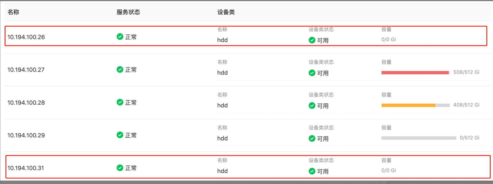
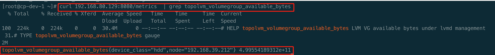
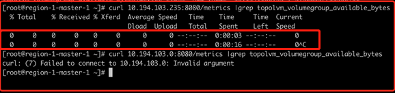

---
kind:
  - Troubleshooting
products:
  - Alauda Container Platform
  - Alauda DevOps
  - Alauda AI
  - Alauda Application Services
  - Alauda Service Mesh
  - Alauda Developer Portal
ProductsVersion:
  - 4.1.0,4.2.x
---
<!-- A type of document that involves encountering a fault, diagnosing it, performing root cause analysis, and providing solutions. -->

# 本地存储

服务磁盘使用率无法监控 节点数据为空 curl podip:8080/metrics |grep topolvm_volumegroup_available_byutes 无数据返回

## Cause
- topolvm-node所在节点的calico网络插件异常
- calico-node处于0/1未启动状态
- 网卡识别错误

## Resolution
- 检查topolvm-node所在节点的calico-node状态
- 重启calico服务
- 修复节点网络

## [workaround]

## [Related Information]
**Screenshots**

- Environment: v3.4.2/v3.6.2 + calico网络
- 8080端口
- /metrics路径
- topolvm-node
- calico-node
- topolvm_volumegroup_available_byutes
- Component: Calico
- Page ID: 110133256
- Original Title: 本地存储-topolvm-服务磁盘使用率无法监控-显示节点数据为空
