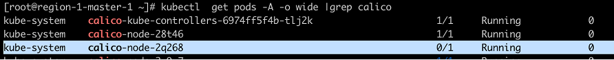
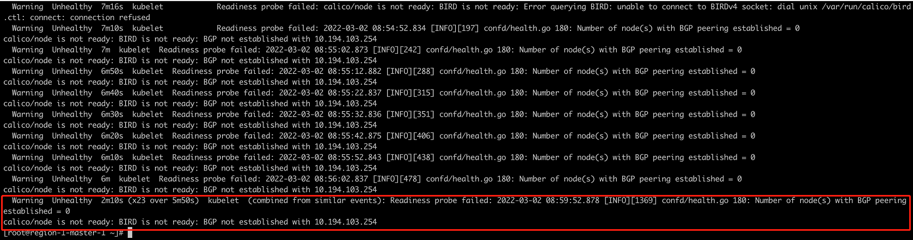
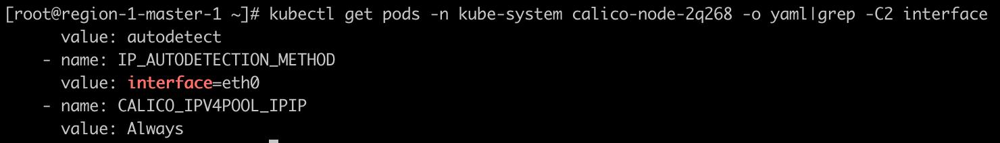
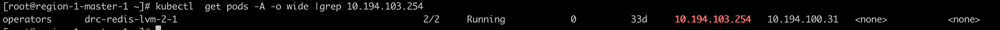

---
kind:
  - Troubleshooting
products:
  - Alauda Container Platform
  - Alauda DevOps
  - Alauda AI
  - Alauda Application Services
  - Alauda Service Mesh
  - Alauda Developer Portal
ProductsVersion:
  - 4.1.0,4.2.x
---
<!-- A type of document that involves encountering a fault, diagnosing it, performing root cause analysis, and providing solutions. -->

# calico

calico-node无法启动处于0/1状态 Pod事件显示网卡异常 检测到的IP与预期网卡(eth0)不匹配

## Cause
- Calico-node启动时检测到错误的IP地址(节点PodIP)
- 检测到的IP与配置的网卡不匹配

## Resolution
- 通过重启calico-node及对应IP的服务恢复

## [workaround]

## [Related Information]
**Screenshots**

- Environment: 通用
- calico-node
- eth0
- IP_AUTODETECTION_METHOD
- Component: Calico
- Page ID: 110133264
- Original Title: 网络-calico-node无法启动处于0/1的状态-无法识别网卡
