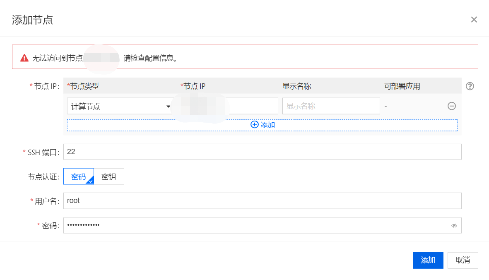
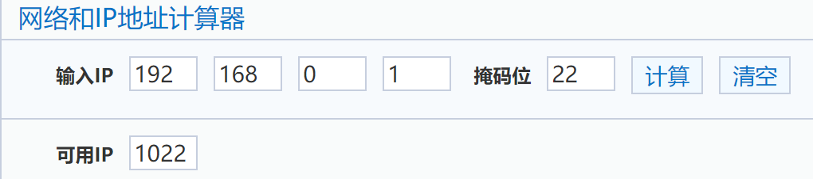
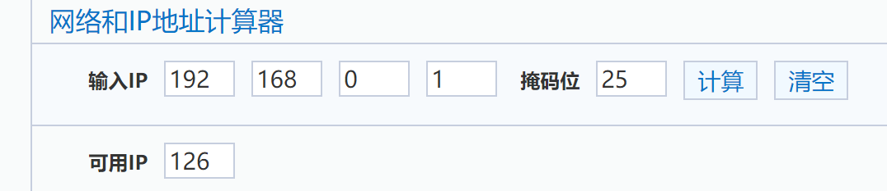

---
kind:
  - Troubleshooting
products:
  - Alauda Container Platform
  - Alauda DevOps
  - Alauda AI
  - Alauda Application Services
  - Alauda Service Mesh
  - Alauda Developer Portal
ProductsVersion:
  - 4.1.0,4.2.x
---
<!-- A type of document that involves encountering a fault, diagnosing it, performing root cause analysis, and providing solutions. -->

# 3.6

添加节点失败，报错'无法访问到节点'

## Cause
- 集群计算节点数已达上限（cluster CIDR为/22时最大支持4个节点）

## Resolution
- 修改maxNodePodNum为128
- 修改nodeCIDRMaskSize为25
- 更新所有业务集群节点的kubelet配置maxPods为128并重启kubelet

## [workaround]

## [Related Information]
**Screenshots**

- Environment: 3.6
- cluster CIDR
- maxNodePodNum
- nodeCIDRMaskSize
- kubectl get cls
- /var/lib/kubelet/config.yaml
- maxPods
- Component: Calico
- Page ID: 112065437
- Original Title: 3.6-calico网络模式的业务集群添加节点失败
