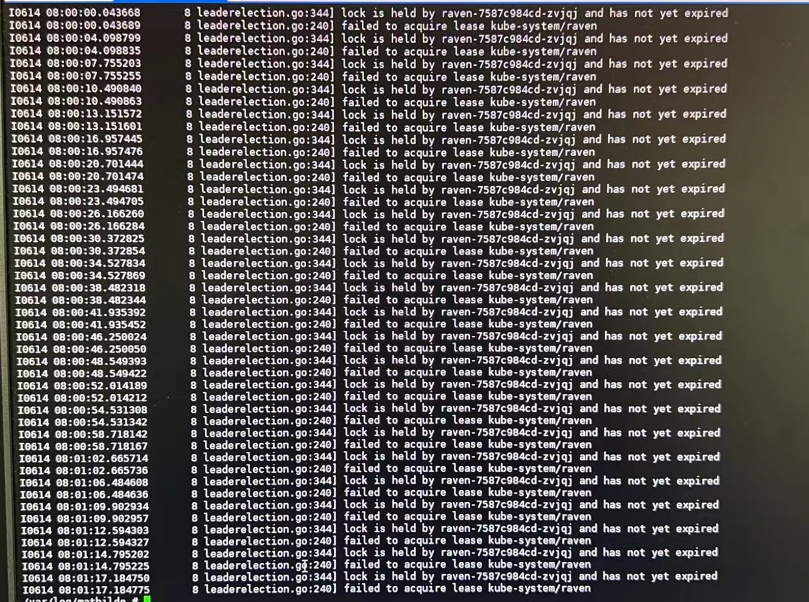
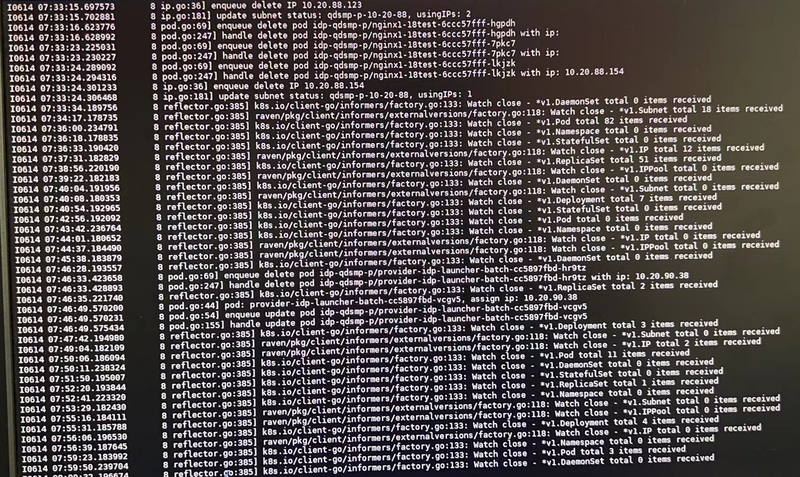
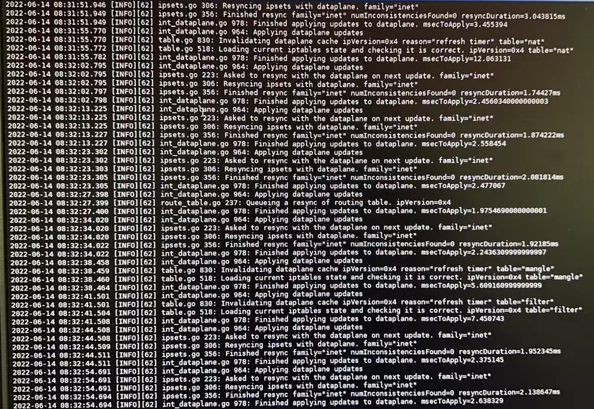
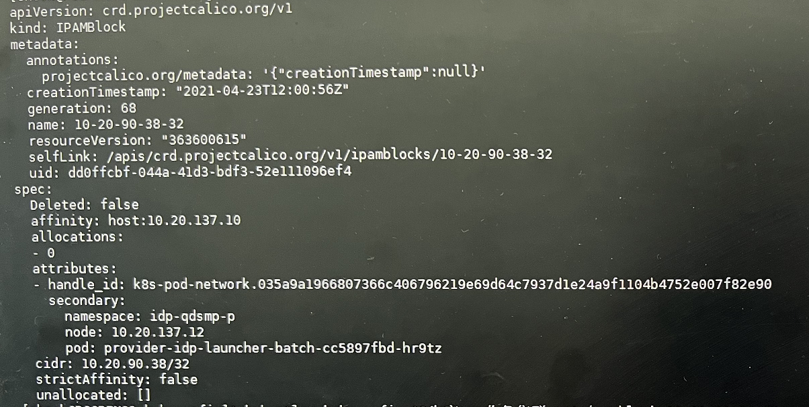
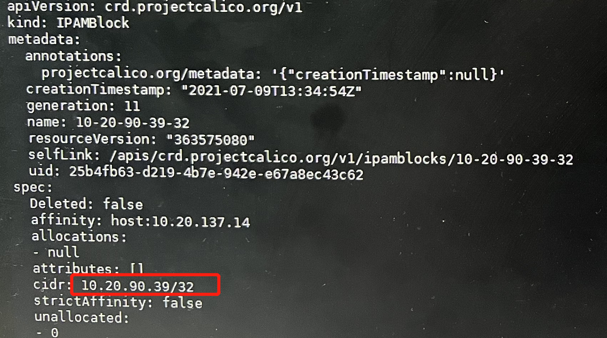

---
kind:
  - Troubleshooting
products:
  - Alauda Container Platform
  - Alauda DevOps
  - Alauda AI
  - Alauda Application Services
  - Alauda Service Mesh
  - Alauda Developer Portal
ProductsVersion:
  - 4.1.0,4.2.x
---
<!-- A type of document that involves encountering a fault, diagnosing it, performing root cause analysis, and providing solutions. -->

# Calico

error getting IP from IPAM:Address already assigned in block pod describe事件信息无IP显示 calicoctl检查显示IP未被分配但实际已被占用

## Cause
- IPAM地址分配状态与实际使用情况不一致
- 调整副本时尝试分配已被占用的固定IP

## Resolution
- 移除服务固定IP配置并重启
- 服务正常启动后重新设置固定IP

## [workaround]

## [Related Information]
**Screenshots**

- Environment: Calico v3.9.0
- calicoctl
- kubectl
- ipamblock
- /var/log/mathilde/raven.log
- pod属性(pod/namespace)
- Component: Calico
- Page ID: 115534728
- Original Title: Calico-设置固定ip的服务调整副本数后，服务无法启动提示error getting IP from IPAM:Address already assigned in block
