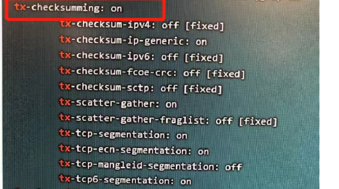

---
kind:
  - Troubleshooting
products:
  - Alauda Container Platform
  - Alauda DevOps
  - Alauda AI
  - Alauda Application Services
  - Alauda Service Mesh
  - Alauda Developer Portal
ProductsVersion:
  - 4.1.0,4.2.x
---
<!-- A type of document that involves encountering a fault, diagnosing it, performing root cause analysis, and providing solutions. -->

# 通过nodeport暴露的业务与业务链接存在链接重置问题

在 node 上直接访问 pod，访问跨节点 pod ping 可以通，curl 没有响应最后链接超时。

## Cause
- 该方式会导致 tcp 吞吐量下降，需要和客户沟通，该问题需要系统和网卡驱动侧处理

## Resolution
- 4、ethtool -k 网卡名称检查节点物理网卡有无使cheksum效验，检查当前问题环境开启了此设置，此cheksum已知应为关闭状态，否则服引起当前上述问题
- ## 解决方案

## [workaround]

## [Related Information]
**Screenshots**

- pod
- 25
- 32
- /wang-luo-tong-guo-nodeportbao-lu-de-ye-wu-yu-ye-wu-lian-jie-cun-zai-lian-jie-zho/image2022-6-14_16-25-32.png
- node
- Component: Calico
- Page ID: 115534740
- Original Title: 网络-通过nodeport暴露的业务与业务链接存在链接重置问题
