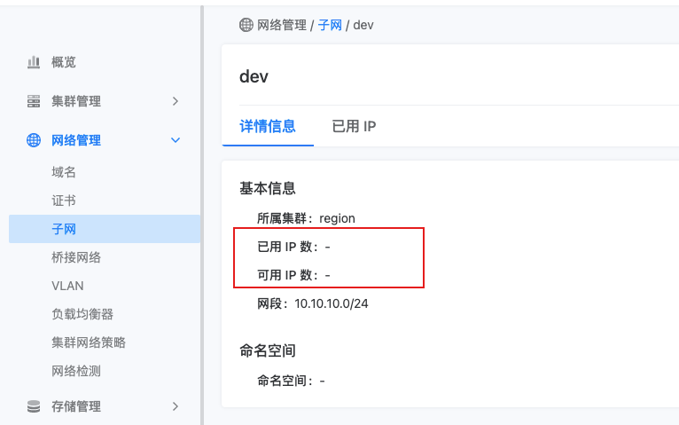

---
kind:
  - Troubleshooting
products:
  - Alauda Container Platform
  - Alauda DevOps
  - Alauda AI
  - Alauda Application Services
  - Alauda Service Mesh
  - Alauda Developer Portal
ProductsVersion:
  - 4.1.0,4.2.x
---
<!-- A type of document that involves encountering a fault, diagnosing it, performing root cause analysis, and providing solutions. -->

# 界面创建子网后界面不显示可用ip

界面创建子网后不显示可用ip 容器无法使用该子网

## Cause
- raven组件被停止，副本数被调成0

## Resolution
- 将raven组件副本数设置为2并启动

## [workaround]

## [Related Information]
**Screenshots**

- Environment: 通用版本（涉及calico、子网）
- raven
- Component: Calico
- Page ID: 115535072
- Original Title: 界面创建子网后界面不显示可用ip
