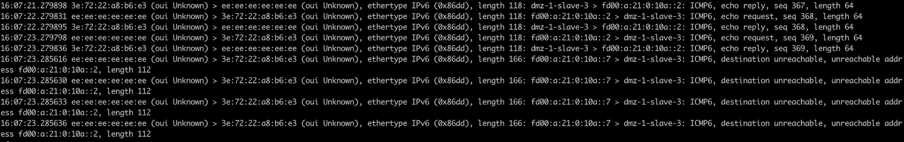
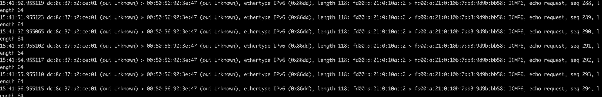

---kind:   - Troubleshootingproducts:    - Alauda Container Platform   - Alauda DevOps   - Alauda AI   - Alauda Application Services   - Alauda Service Mesh   - Alauda Developer PortalProductsVersion:   - 4.1.0,4.2.x---<!-- A type of document that involves encountering a fault, diag...it, performing root cause analysis, and providing solutions. --># 双栈网络节点无法通过 IPv6 访问其它节点 Podnode1 无法通过 IPv6 地址访问 node2 上的 Pod node2 未将来自 Pod 的 ICMP 响应发送给 node1 Pod 收到 ICMP 错误信息: destination unreachable, unreachable address fd00:a:21:0:10a::2## Cause- 克隆的 VMWare 虚拟机导致所有节点 machine id 相同- IPv6 Link Local 地址基于 machine id 生成引发地址冲突- sysctl 参数 net.ipv6.conf.ens192.accept_ra=1 和 autoconf=1 导致默认路由异常## Resolution- 修改 machine id: `uuidgen |sed 's/-//g' > /etc/machine-id`- 同步 machine id: `cat /etc/machine-id > /var/lib/dbus/machine-id`- 重启系统## [workaround]## [Related Information]**Screenshots**- Environment: CentOS 7- Calico BGP- ens192- sysctl: net.ipv6.conf.ens192.accept_ra- sysctl: net.ipv6.conf.ens192.autoconf- NetworkManager- IPv6 Link Local 地址- machine-id- Component: Calico- Page ID: 115536534- Original Title: 双栈网络节点无法通过 IPv6 访问其它节点 Pod