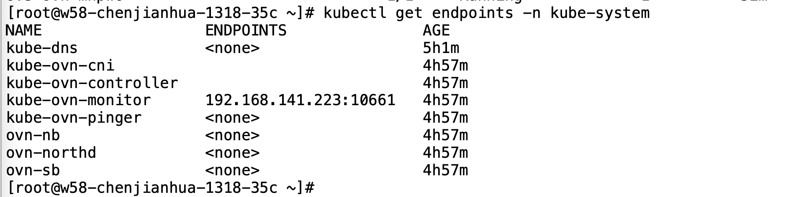
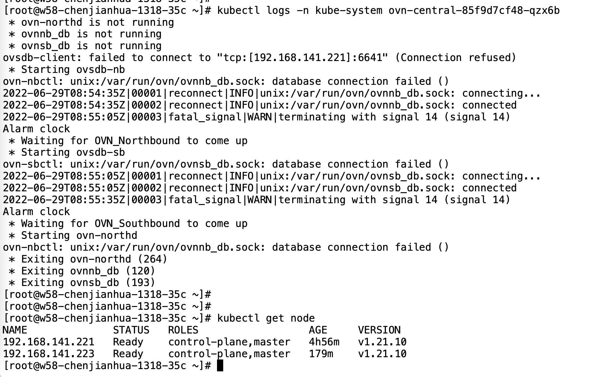
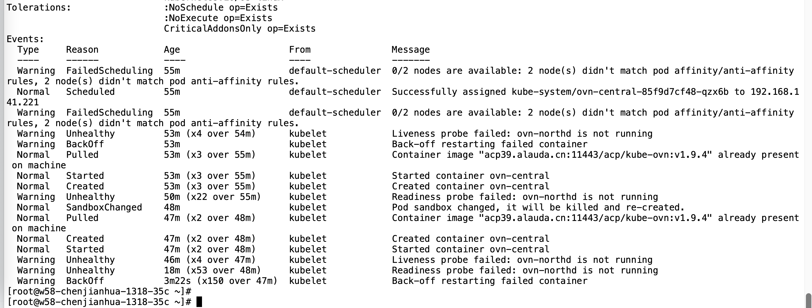
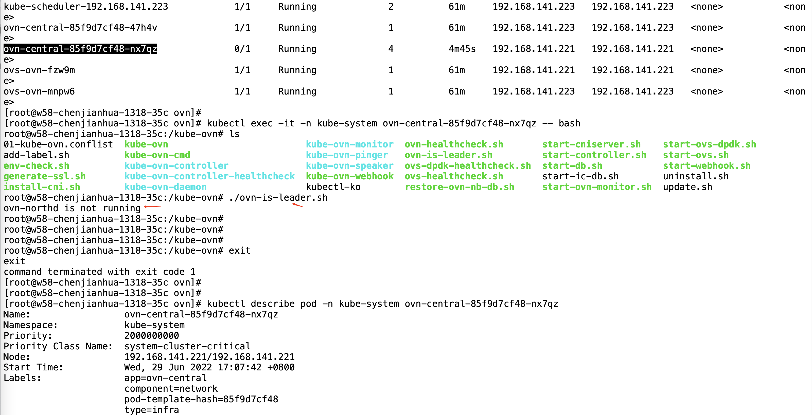
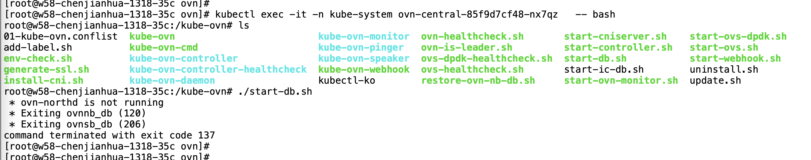
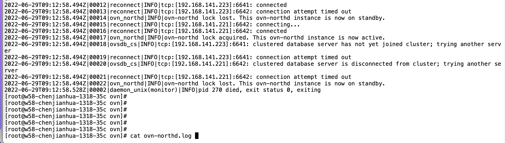

---
kind:
  - Troubleshooting
products:
  - Alauda Container Platform
  - Alauda DevOps
  - Alauda AI
  - Alauda Application Services
  - Alauda Service Mesh
  - Alauda Developer Portal
ProductsVersion:
  - 4.1.0,4.2.x
---
<!-- A type of document that involves encountering a fault, diagnosing it, performing root cause analysis, and providing solutions. -->

# 2022

删除并重新添加master节点后无法再次添加 剩余两个ovn-central pod中一个不断重启 ovn-northd未启动成功

## Cause
- ovn-northd数据库状态异常
- 非标准操作流程删除master节点导致状态不一致

## Resolution
- 执行数据库重置操作恢复DB状态

## [workaround]

## [Related Information]
**Screenshots**

- Environment: ACP 3.9 第一轮发版环境，Kubernetes集群，CNI v1.9.4
- ovn-central
- ovn-northd
- endpoints
- 健康检查脚本
- db启动脚本
- Component: Calico
- Page ID: 119085645
- Original Title: 2022-6-29 发版第一轮环境，删除master节点问题
