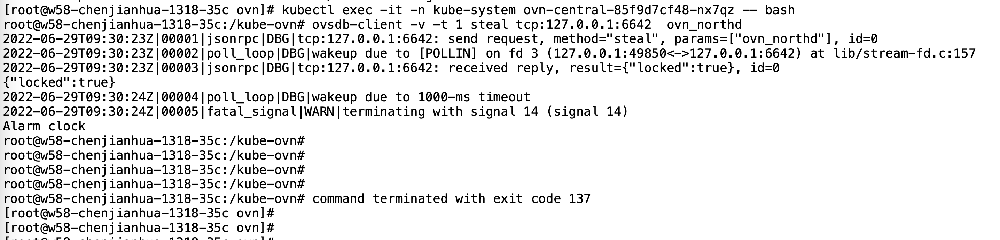

---kind:   - Troubleshootingproducts:    - Alauda Container Platform   - Alauda DevOps   - Alauda AI   - Alauda Application Services   - Alauda Service Mesh   - Alauda Developer PortalProductsVersion:   - 4.1.0,4.2.x---<!-- A type of document that involves encountering a fault, diag...it, performing root cause analysis, and providing solutions. --># 2022ovn-central pod 不断重启 ovn-northd 未启动成功 endpoints 无 leader 信息## Cause- 直接删除 master 节点导致 ovn 数据库状态异常## Resolution- 重置 DB 恢复## [workaround]## [Related Information]**Screenshots**- Environment: ACP 3.9, CNI v1.9.4- ovn-central- ovn-northd- endpoints- 健康检查脚本- 启动db脚本- Component: Calico- Page ID: 119085645- Original Title: 2022-6-29 发版第一轮环境，删除master节点问题