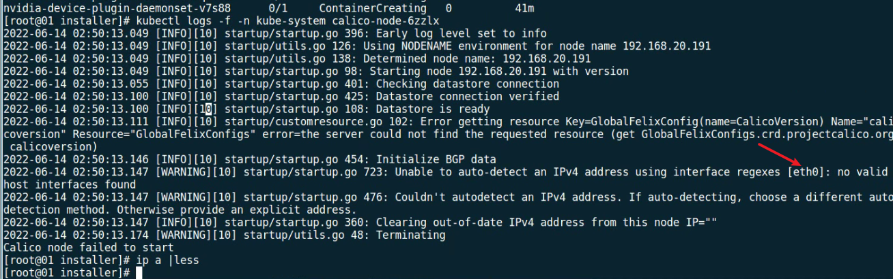

---
kind:
  - Troubleshooting
products:
  - Alauda Container Platform
  - Alauda DevOps
  - Alauda AI
  - Alauda Application Services
  - Alauda Service Mesh
  - Alauda Developer Portal
ProductsVersion:
  - 4.1.0,4.2.x
---
<!-- A type of document that involves encountering a fault, diagnosing it, performing root cause analysis, and providing solutions. -->

# 3.8.1

部署global失败 calico controller和calico-node pod无法正常运行 安装日志显示填写的网卡为eth0而实际网卡名称不符

## Cause
- 部署时填写的网卡名称（eth0）与主机实际网卡名称不匹配

## Resolution
- 所有部署节点执行清理脚本后重新部署，填写正确的网卡名称

## [workaround]

## [Related Information]
**Screenshots**

- Environment: 3.8.1-arm（calico网络）
- calico-controller
- calico-node
- 网卡名称配置
- Component: Calico
- Page ID: 119086010
- Original Title: 3.8.1-基础架构-3.8.1-arm（calico网络） 部署global失败
