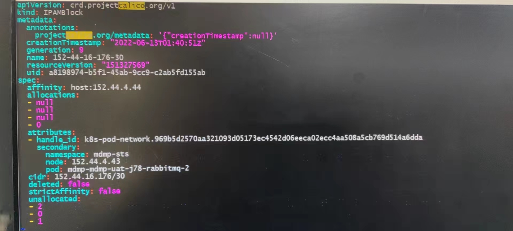

---kind:   - Troubleshootingproducts:    - Alauda Container Platform   - Alauda DevOps   - Alauda AI   - Alauda Application Services   - Alauda Service Mesh   - Alauda Developer PortalProductsVersion:   - 4.1.0,4.2.x---<!-- A type of document that involves encountering a fault, diag...it, performing root cause analysis, and providing solutions. --># 节点故障/重启后，使用固定 IP 的 Pod 无法正常创建error getting IP from IPAM: resource already exists: xxx.xxx.xxx.xxx calicoctl ipam show --ip=<IP> shows IP not assigned calicoctl ipam release --ip=<IP> fails to release IP## Cause- Calico IPAM 中 IP 地址状态不一致（CRD 记录与实际分配状态不符）## Resolution- 定位故障 IP 所在的 ipamblock CR- 修改 allocations/attributes/unallocated 字段- 执行 kubectl apply --validate=false --server-side=true --force-conflicts=true -f <YAML> 更新 CR## [workaround]- 手动修改 ipamblock CR 释放 IP## [Related Information]**Screenshots**- Environment: Kubernetes v1.21.4, Calico v3.16.1, ACP v3.6- cni.projectcalico.org/ipAddrs- ipamblock CRD- calicoctl- CIDR block- Component: Calico- Page ID: 120118414- Original Title: 节点故障/重启后，使用固定 IP 的 Pod 无法正常创建