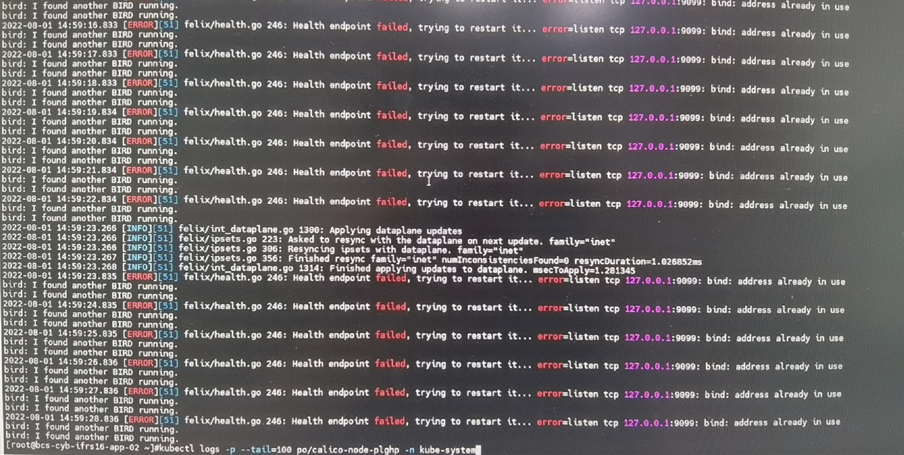
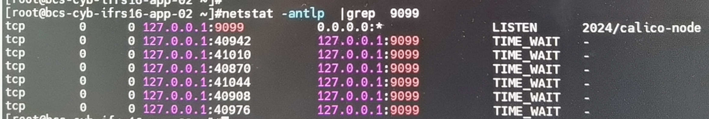
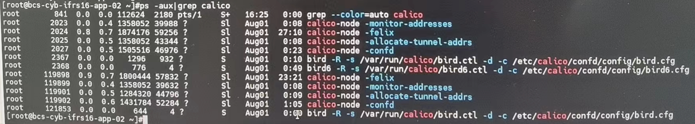

---
kind:
  - Troubleshooting
products:
  - Alauda Container Platform
  - Alauda DevOps
  - Alauda AI
  - Alauda Application Services
  - Alauda Service Mesh
  - Alauda Developer Portal
ProductsVersion:
  - 4.1.0,4.2.x
---
<!-- A type of document that involves encountering a fault, diagnosing it, performing root cause analysis, and providing solutions. -->

# calico

calico-node无法启动 日志报错127.0.0.1:9099: bind: address already in use

## Cause
- calico-node历史进程占用9099端口

## Resolution
- 执行ps -aux |grep calico检查历史进程
- 使用kill -9 进程号清理历史进程

## [workaround]

## [Related Information]
**Screenshots**

- Environment: 通用
- 9099端口
- calico-node组件
- netstst -antlp|grep 9099
- ps -aux |grep calico
- Component: Calico
- Page ID: 120119399
- Original Title: calico-node无法启动-日志报错127.0.0.1 : 9099 : bind : address already in use
