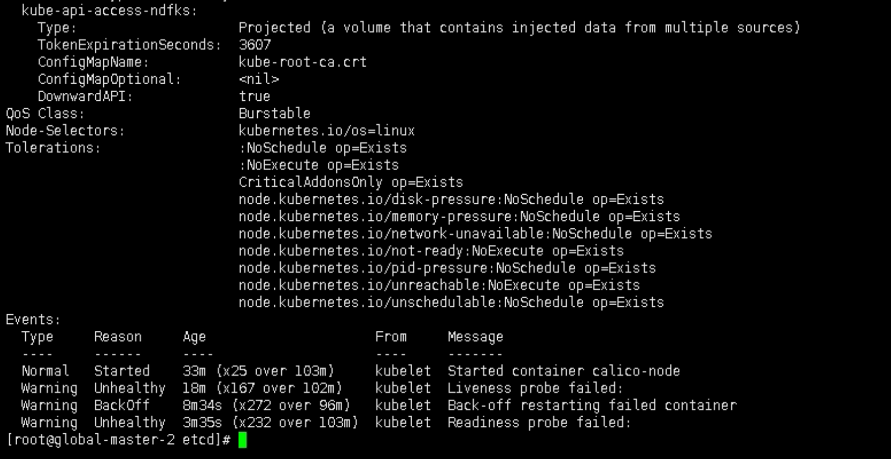
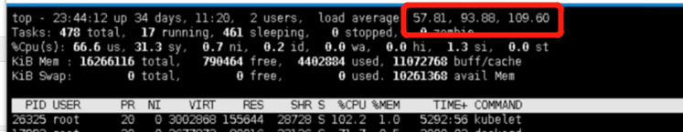
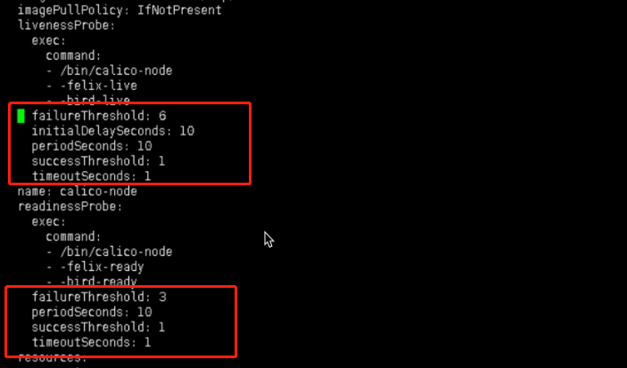

---
kind:
  - Troubleshooting
products:
  - Alauda Container Platform
  - Alauda DevOps
  - Alauda AI
  - Alauda Application Services
  - Alauda Service Mesh
  - Alauda Developer Portal
ProductsVersion:
  - 4.1.0,4.2.x
---
<!-- A type of document that involves encountering a fault, diagnosing it, performing root cause analysis, and providing solutions. -->

# calico

calico-node实例健康检查失败，服务退出码为0 calico-node日志未发现error级别日志 节点负载显著高于正常水平

## Cause
- 节点负载过高导致calico-node健康检查超时

## Resolution
- 修改calico-node的DaemonSet资源，将livenessProbe和readinessProbe的timeoutSeconds参数从1调整为60
- 执行命令备份配置：kubectl get ds -nkube-system calico-node >>calico-node-ds-old.yaml
- 触发calico-node滚动重建

## [workaround]

## [Related Information]
**Screenshots**

- Environment: 通用
- calico-node DaemonSet
- livenessProbe
- readinessProbe
- timeoutSeconds
- Component: Calico
- Page ID: 124687440
- Original Title: calico-node实例无法启动-节点自身负载影响
