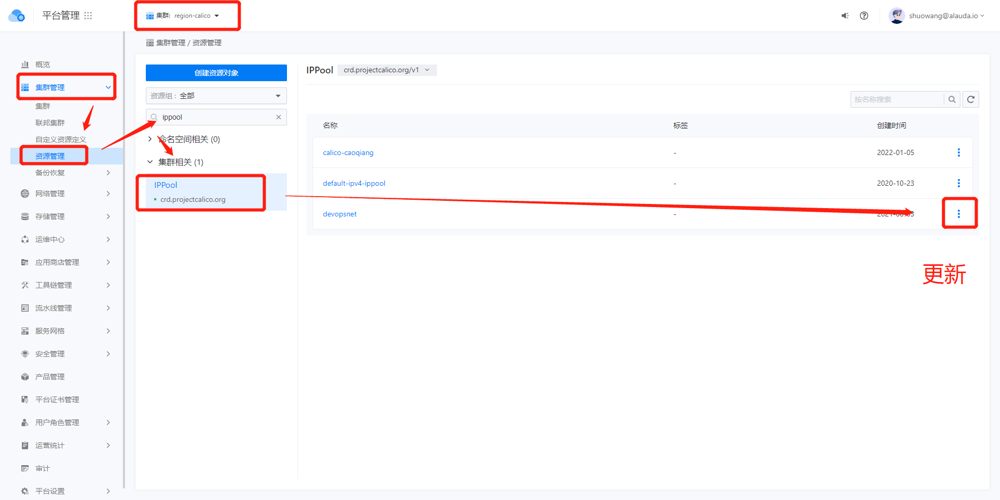
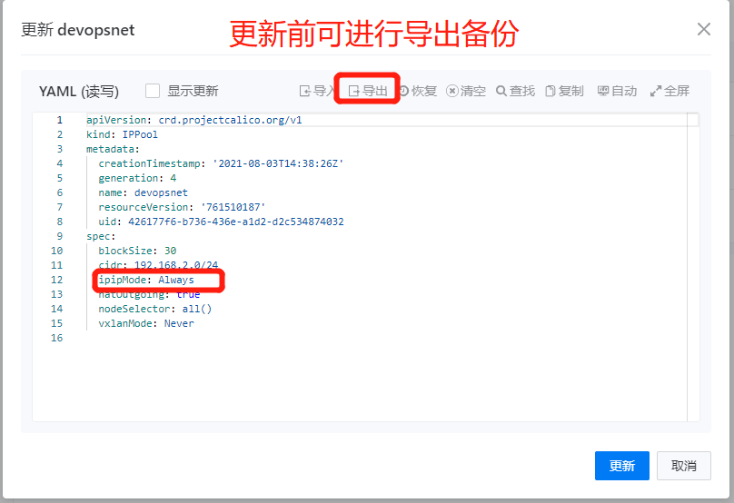
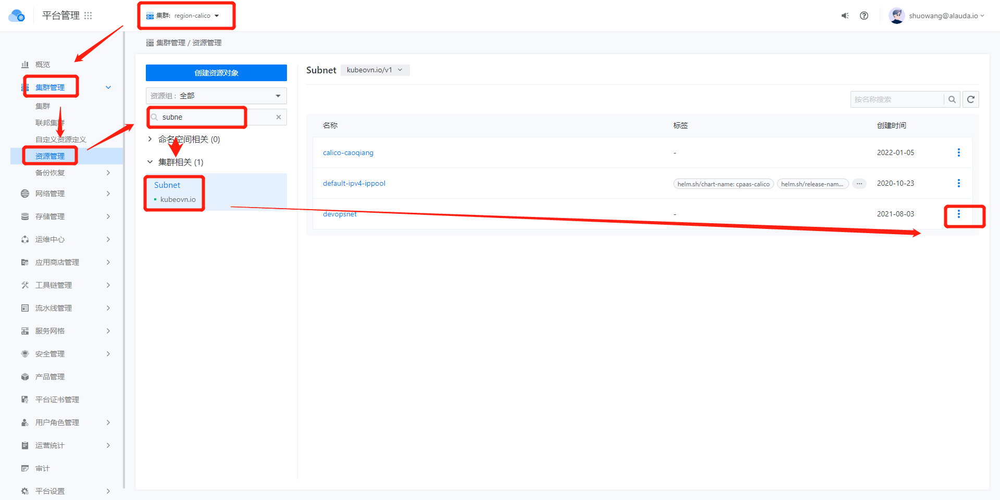
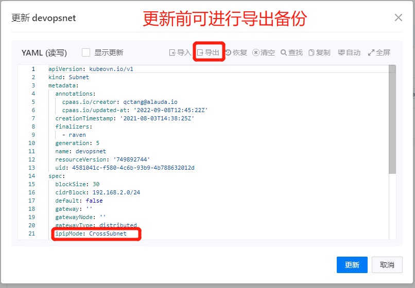
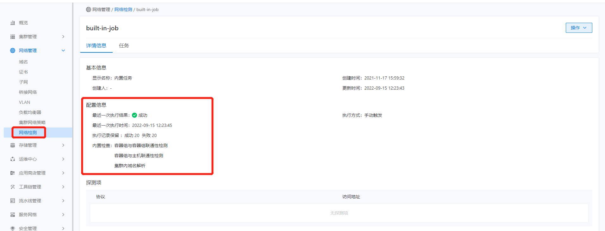

---
kind:
  - Troubleshooting
products:
  - Alauda Container Platform
  - Alauda DevOps
  - Alauda AI
  - Alauda Application Services
  - Alauda Service Mesh
  - Alauda Developer Portal
ProductsVersion:
  - 4.1.0,4.2.x
---
<!-- A type of document that involves encountering a fault, diagnosing it, performing root cause analysis, and providing solutions. -->

# 3.4.2

平台界面无法直接设置calico的ipip模式 默认ipip模式为Never不符合现场网络需求

## Cause
- 3.4.2版本平台界面未提供直接修改calico ipip模式的配置入口

## Resolution
- 通过集群-资源管理修改IPPool资源的ipipMode参数（注意大小写）
- 通过集群-资源管理修改Subnet资源的ipipMode参数（注意大小写）
- 修改后通过网络管理-网络检查验证容器网络状态

## [workaround]

## [Related Information]
**Screenshots**
2、更新对应IPPool资源ipipMode参数设置到对应参数（注意大小写）

4、更新对应subnet资源ipipMode参数设置到对应参数（注意大小写）

- Environment: 3.4.2
- IPPool
- Subnet
- ipipMode
- 网络检查
- Component: Calico
- Page ID: 124696296
- Original Title: 3.4.2-Calico设置ipip模式
