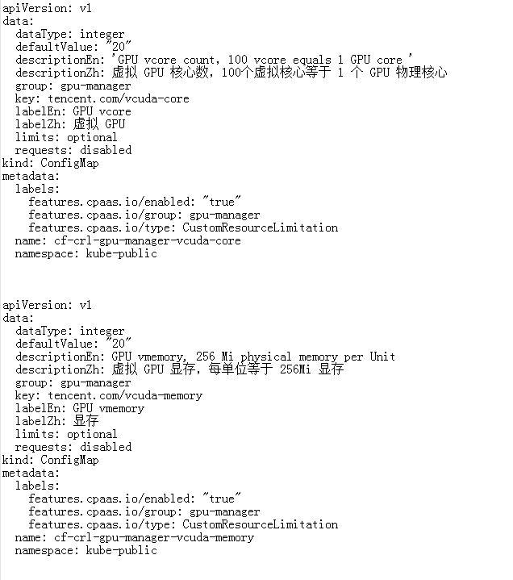

---
kind:
  - Troubleshooting
products:
  - Alauda Container Platform
  - Alauda DevOps
  - Alauda AI
  - Alauda Application Services
  - Alauda Service Mesh
  - Alauda Developer Portal
ProductsVersion:
  - 4.1.0,4.2.x
---
<!-- A type of document that involves encountering a fault, diagnosing it, performing root cause analysis, and providing solutions. -->

# 3.6.1

项目和命名空间无法进行GPU配额 GPU配额不显示

## Cause
- 缺少cf-crl-gpu-manager-vcuda-core和cf-crl-gpu-manager-vcuda-memory的configmap资源

## Resolution
- 手动创建cf-crl-gpu-manager-vcuda-core和cf-crl-gpu-manager-vcuda-memory的configmap资源

## [workaround]

## [Related Information]
**Screenshots**
global集群为vgpu集群，网络使用calico网络。原本无GPU节点，新加GPU节点后，项目和命名空间无法进行GPU配额。

- Environment: 3.6.1版本容器平台，global集群使用calico网络和vgpu技术
- cf-crl-gpu-manager-vcuda-core
- cf-crl-gpu-manager-vcuda-memory
- vgpu
- calico
- Component: Calico
- Page ID: 124696665
- Original Title: 3.6.1-容器平台-global集群新加GPU节点后项目和命名空间无法进行GPU配额
