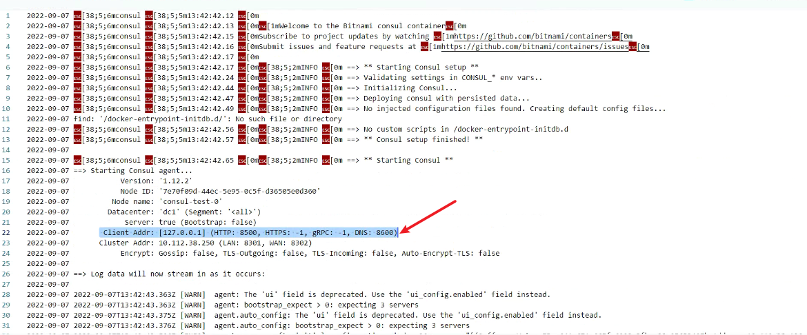
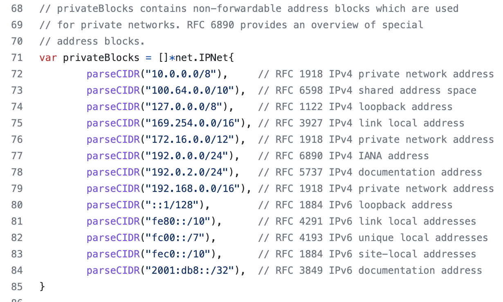

---
kind:
  - Troubleshooting
products:
  - Alauda Container Platform
  - Alauda DevOps
  - Alauda AI
  - Alauda Application Services
  - Alauda Service Mesh
  - Alauda Developer Portal
ProductsVersion:
  - 4.1.0,4.2.x
---
<!-- A type of document that involves encountering a fault, diagnosing it, performing root cause analysis, and providing solutions. -->

# 3.8.2

No private IPv4 address found during consul chart 10.7.4 deployment

## Cause
- OVN network CIDR does not meet consul's requirements

## Resolution
- Adjust OVN network CIDR to comply with consul's specifications

## [workaround]

## [Related Information]
**Screenshots**
1、初步排查判断consul服务启动时有个 -bind 0.0.0.0 的参数，ovn网络和calico网络底层不一样导致部署问题

- Environment: kubeovn network on version 3.8.2
- -bind 0.0.0.0
- kubeovn network configuration
- Component: Calico
- Page ID: 127409163
- Original Title: 3.8.2-容器平台-部署consul-10.7.4 chart失败
