---
kind:
  - Troubleshooting
products:
  - Alauda Container Platform
  - Alauda DevOps
  - Alauda AI
  - Alauda Application Services
  - Alauda Service Mesh
  - Alauda Developer Portal
ProductsVersion:
  - 4.1.0,4.2.x
---
<!-- A type of document that involves encountering a fault, diagnosing it, performing root cause analysis, and providing solutions. -->

# 2022

kubectl命令超时 新添加的master节点未被监控到 跨节点访问Pod网络不通

## Cause
- Calico的IP_AUTODETECTION_METHOD配置使用can-reach方式导致网卡选择异常
- 跨云环境（云上虚拟机+本地虚拟化）网络接口识别问题

## Resolution
- 修改Calico配置将IP检测方式改为指定接口：IP_AUTODETECTION_METHOD=interface=eth0

## [workaround]

## [Related Information]
**Screenshots**
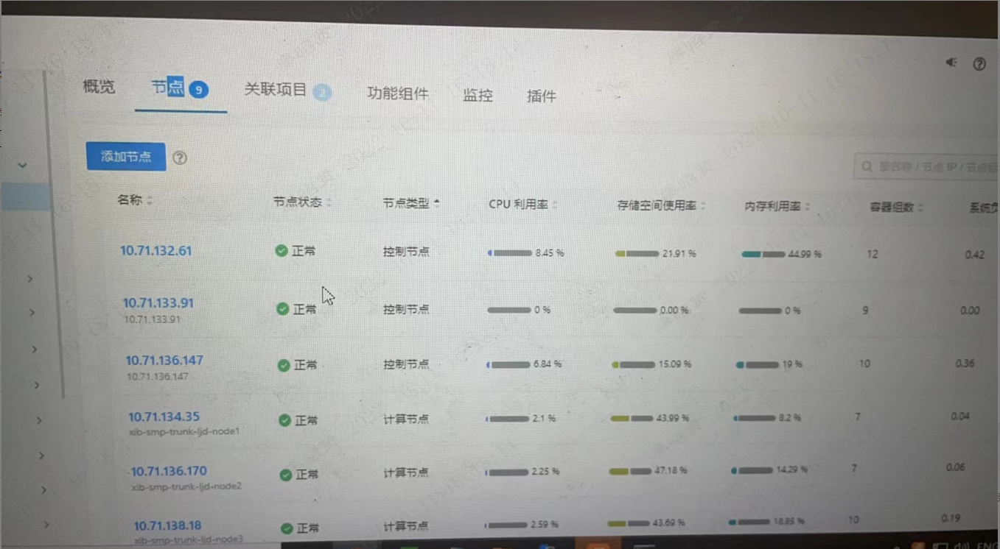
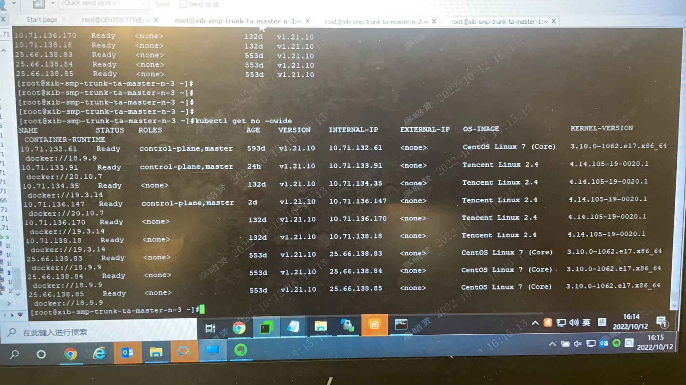
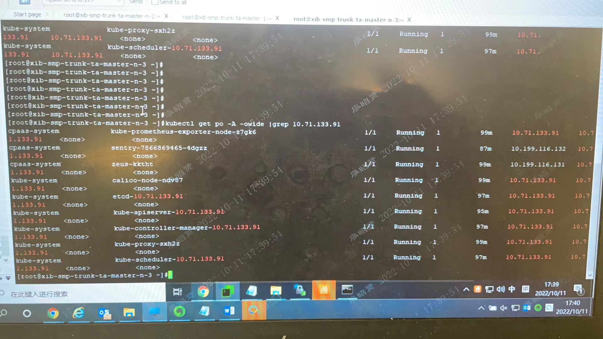
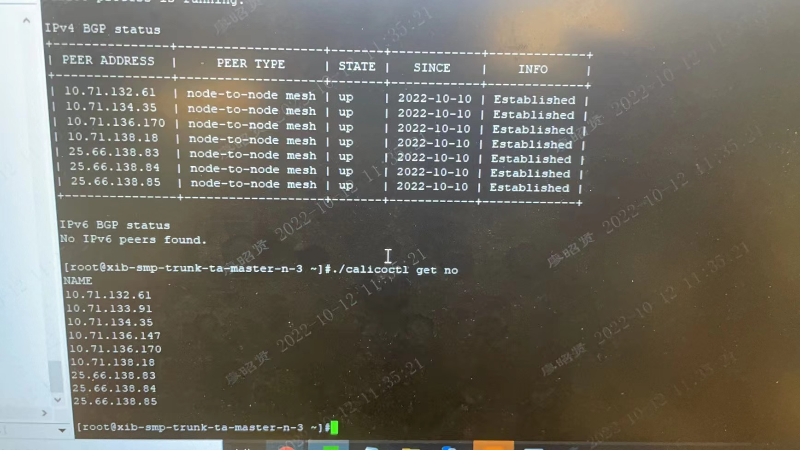

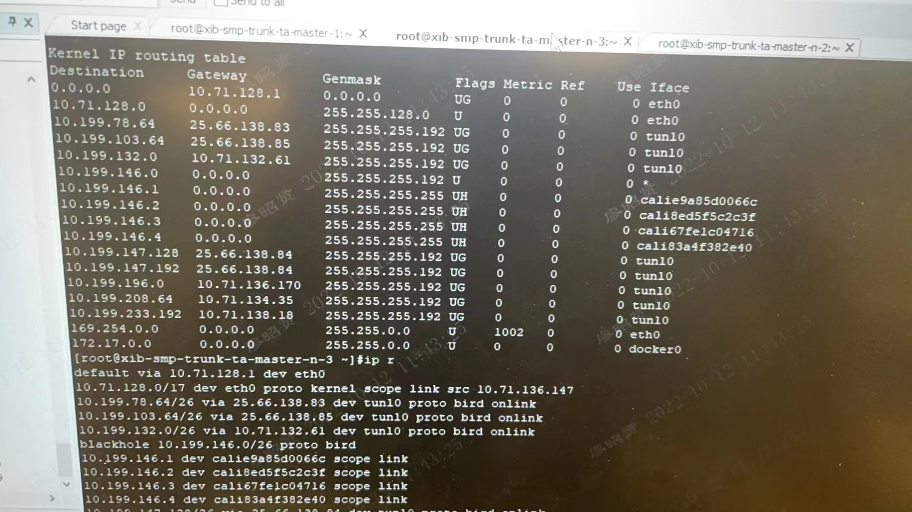
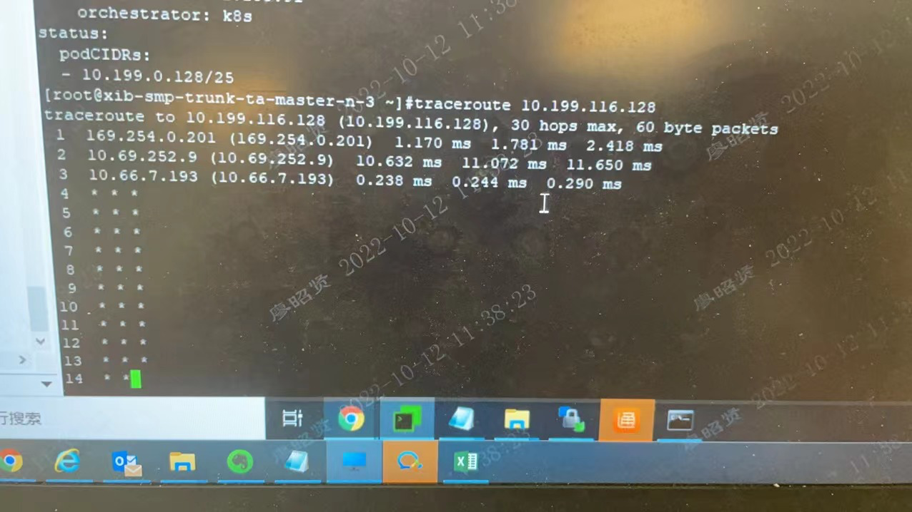
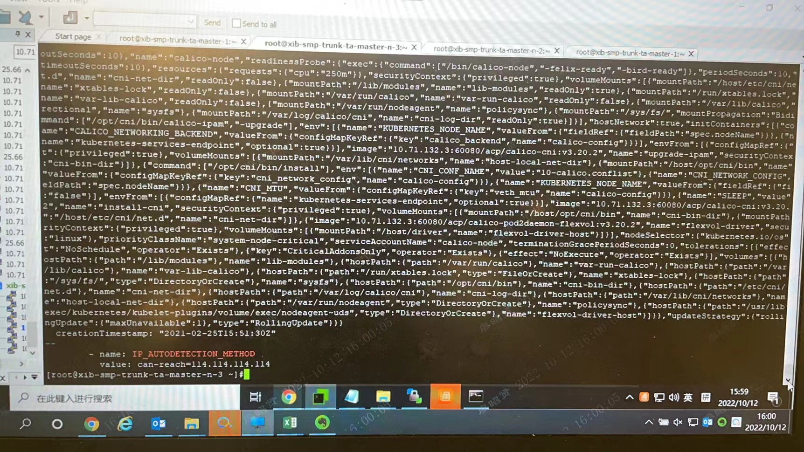
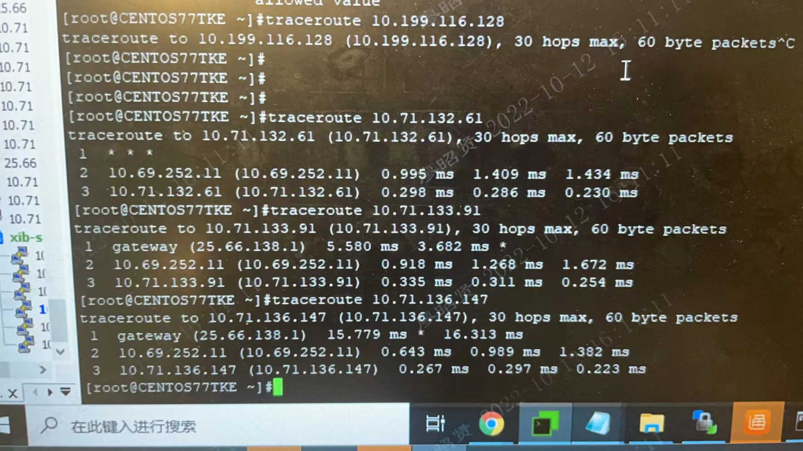
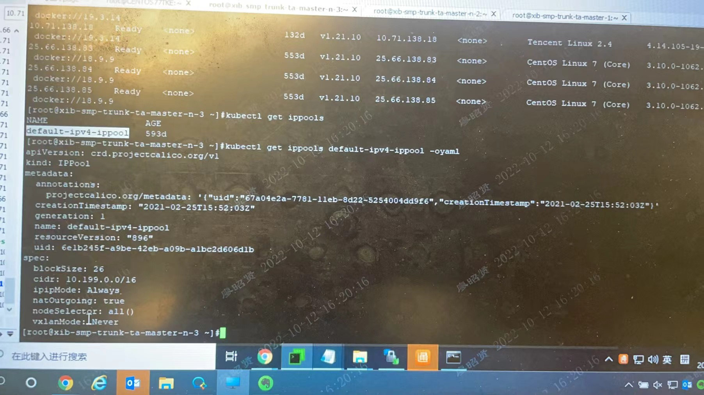
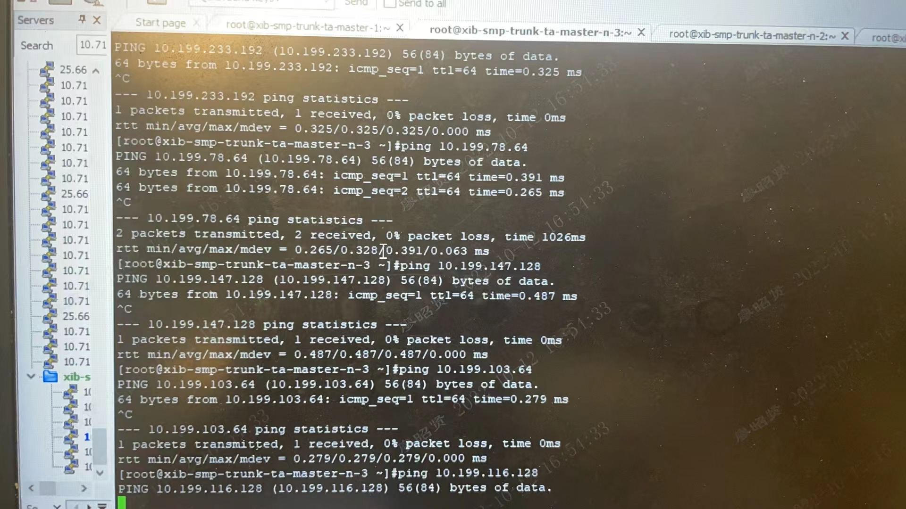
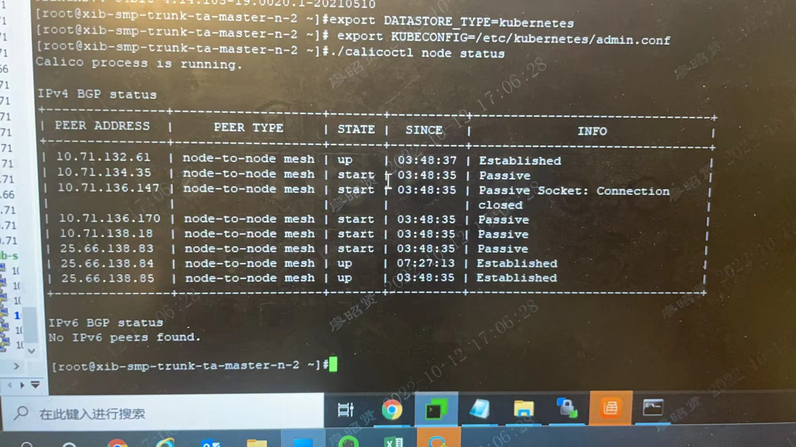
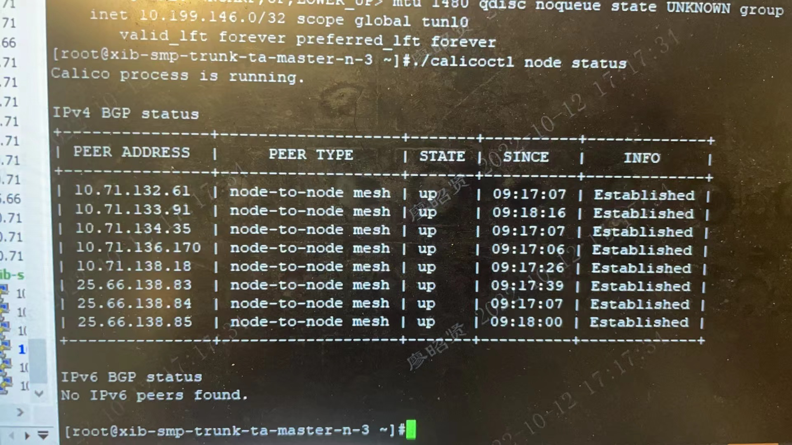
- Environment: ACP3.8.2(Kubernetes)、Calico v3.20.2、混合云环境（云上虚拟机+本地虚拟化VM）
- IP_AUTODETECTION_METHOD
- tunl0接口
- BGP邻居
- calico-node
- kube-apiserver
- /etc/cni/net.d/10-calico.conflist
- Component: Calico
- Page ID: 127420245
- Original Title: 2022-10-12 厦门银行更换集群master节点，出现跨节点访问不通问题
