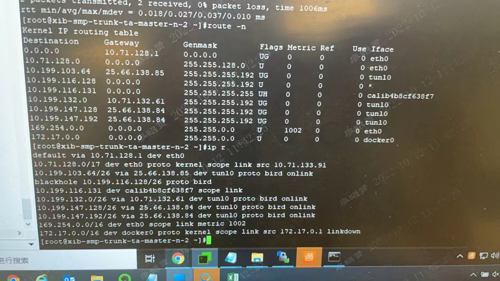

---kind:   - Troubleshootingproducts:    - Alauda Container Platform   - Alauda DevOps   - Alauda AI   - Alauda Application Services   - Alauda Service Mesh   - Alauda Developer PortalProductsVersion:   - 4.1.0,4.2.x---<!-- A type of document that involves encountering a fault, diag...it, performing root cause analysis, and providing solutions. --># 2022kubectl命令超时 新添加的master节点(10.71.133.91)未被监控到 跨节点访问其他节点Pod失败## Cause- Calico接口自动检测异常(原配置使用can-reach自动检测)- BGP邻居关系建立失败导致路由同步异常## Resolution- 修改calico-node的IP_AUTODETECTION_METHOD配置为iface=eth0- 确认calico配置中INTERFACE参数显式指定为eth0## [workaround]## [Related Information]**Screenshots**- Environment: Kubernetes ACP3.8.2, Calico v3.20.2- calico-node- IPPool 10.168.0.0/16- tunl0接口- BGP协议- IP_AUTODETECTION_METHOD- calicoctl node status- Component: Calico- Page ID: 127420245- Original Title: 2022-10-12 厦门银行更换集群master节点，出现跨节点访问不通问题