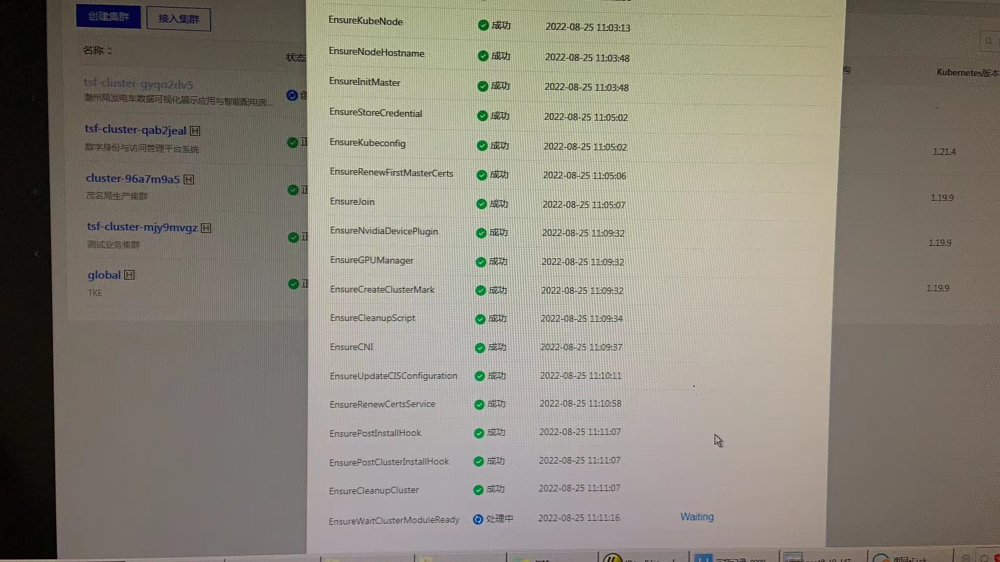
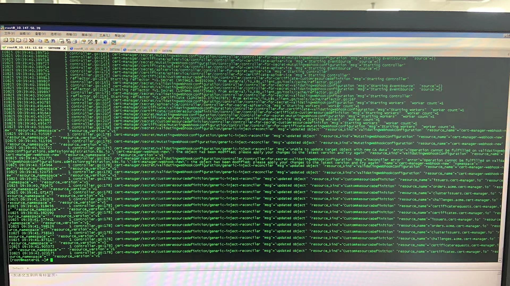

---
kind:
  - Troubleshooting
products:
  - Alauda Container Platform
  - Alauda DevOps
  - Alauda AI
  - Alauda Application Services
  - Alauda Service Mesh
  - Alauda Developer Portal
ProductsVersion:
  - 4.1.0,4.2.x
---
<!-- A type of document that involves encountering a fault, diagnosing it, performing root cause analysis, and providing solutions. -->

# 部署业务集群卡在EnsureWaitClusterModuleReady

部署业务集群卡在EnsureWaitClusterModuleReady阶段 metis pod处于创建中且事件显示缺少secret ARS调用webhook失败

## Cause
- calico网卡mtu值配置大于物理网卡mtu值

## Resolution
- 调整calico网卡mtu值至小于物理网卡mtu值

## [workaround]

## [Related Information]
**Screenshots**

- Environment: TKE 3.6.1
- cert-manager-webhook
- metis-serving
- calico
- secret
- ARS
- Component: Calico
- Page ID: 127430250
- Original Title: 部署业务集群卡在EnsureWaitClusterModuleReady
