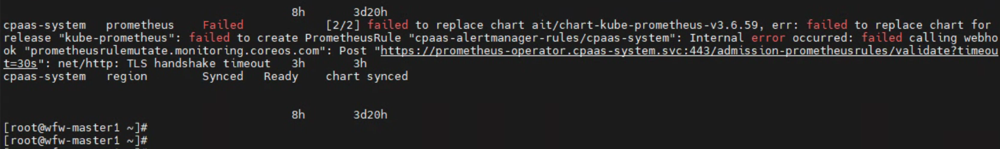
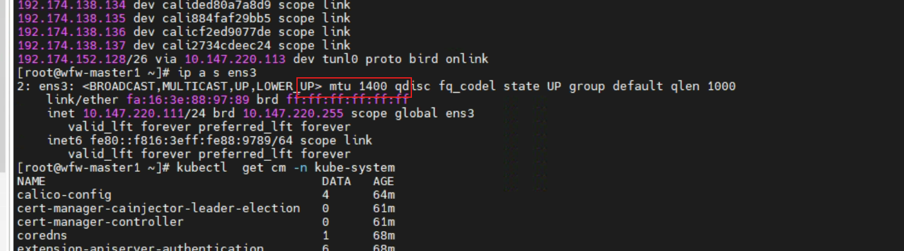

---
kind:
  - Troubleshooting
products:
  - Alauda Container Platform
  - Alauda DevOps
  - Alauda AI
  - Alauda Application Services
  - Alauda Service Mesh
  - Alauda Developer Portal
ProductsVersion:
  - 4.1.0,4.2.x
---
<!-- A type of document that involves encountering a fault, diagnosing it, performing root cause analysis, and providing solutions. -->

# calico网络模式部署prometheus失败

部署prometheus失败报错和operator的svc握手超时 prometheus-operator pod处于Create状态 secret 'prometheus-operator-admission' not found

## Cause
- calico默认mtu(1500)大于底层网卡实际mtu导致网络异常

## Resolution
- 修改calico的mtu配置为1300

## [workaround]
- 手动创建并应用prometheus-operator-admission secret可使operator启动

## [Related Information]
**Screenshots**

- Environment: TKE
- prometheus-operator-admission
- calico_mtu
- TKE网络组件
- Component: Calico
- Page ID: 130576412
- Original Title: calico网络模式部署prometheus失败
