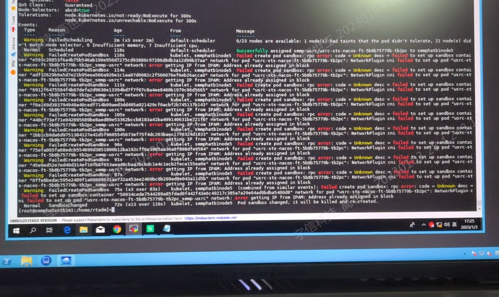

---
kind:
  - Troubleshooting
products:
  - Alauda Container Platform
  - Alauda DevOps
  - Alauda AI
  - Alauda Application Services
  - Alauda Service Mesh
  - Alauda Developer Portal
ProductsVersion:
  - 4.1.0,4.2.x
---
<!-- A type of document that involves encountering a fault, diagnosing it, performing root cause analysis, and providing solutions. -->

# calico网络下容器固定IP，机器重启后IP不释放导致新容器无法启动

新容器调度至其他节点无法启动 报错信息: network: error getting IP from IPAM: Address already assigned in block

## Cause
- calico 3.20以下版本存在IPAM垃圾回收机制缺失

## Resolution
- 升级calico网络插件或平台版本至3.8以上

## [workaround]
- kubectl -n kube-system cp $(kubectl -n kube-system get pods | grep raven| awk 'NR==1''{print $1}'):raven/calicoctl ./calicoctl
- export DATASTORE_TYPE=kubernetes
- export KUBECONFIG=/etc/kubernetes/admin.conf
- calicoctl ipam show --ip=<待释放IP>
- calicoctl ipam release --ip=<待释放IP>

## [Related Information]
**Screenshots**

- Environment: calico 3.20版本以下
- calicoctl
- IPAM
- /etc/kubernetes/admin.conf
- KUBECONFIG
- github.com/projectcalico/calico/issues/5339
- Component: Calico
- Page ID: 133094300
- Original Title: calico网络下容器固定IP，机器重启后IP不释放导致新容器无法启动
