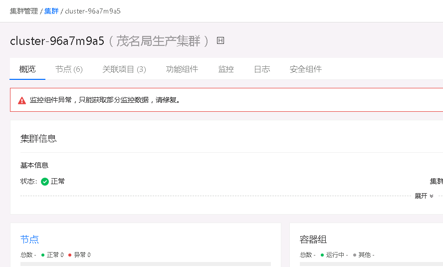

---
kind:
  - Troubleshooting
products:
  - Alauda Container Platform
  - Alauda DevOps
  - Alauda AI
  - Alauda Application Services
  - Alauda Service Mesh
  - Alauda Developer Portal
ProductsVersion:
  - 4.1.0,4.2.x
---
<!-- A type of document that involves encountering a fault, diagnosing it, performing root cause analysis, and providing solutions. -->

# TKE容器平台业务集群提示"监控组件异常，只能获取部分监控数据，请修复"

监控组件异常，只能获取部分监控数据 sentry日志中报prometheus operator与warlock之间post请求发生x509错误 卸载监控重新部署后ars报错与prometheus operator链接超时

## Cause
- etcd数据目录过大（400M）及events资源过多（9w条）
- warlock使用的secret配置错误导致x509证书问题
- kube-proxy或calico-node网络组件异常导致连接超时

## Resolution
- 清理etcd数据目录，减少events资源数量
- 删除warlock pod使用的secret，重启sentry以重新生成
- 卸载并重新部署监控组件
- 重启kube-proxy和calico-node

## [workaround]

## [Related Information]
**Screenshots**

- Environment: TKE 3.6
- etcd
- prometheus-operator
- warlock
- sentry
- kube-proxy
- calico-node
- secret
- Component: Calico
- Page ID: 133095010
- Original Title: TKE容器平台业务集群提示"监控组件异常，只能获取部分监控数据，请修复"
