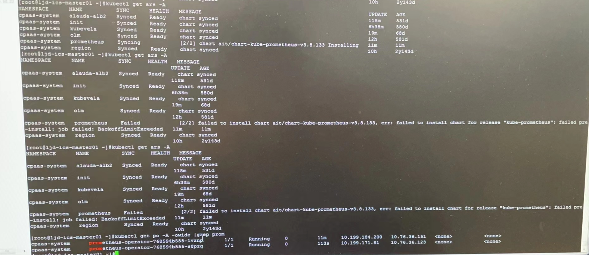
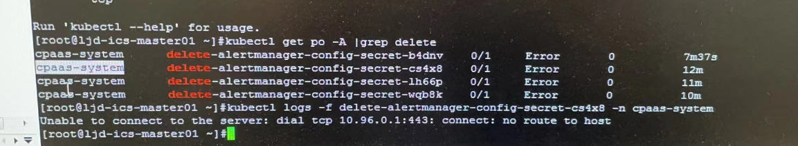
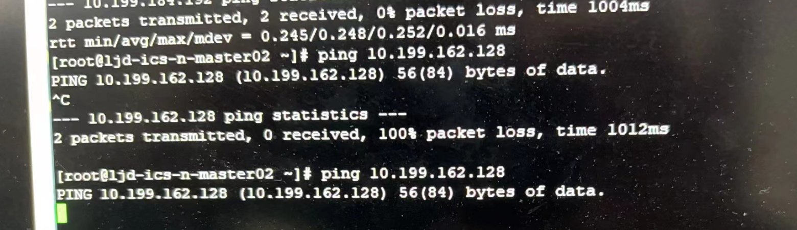

---
kind:
  - Troubleshooting
products:
  - Alauda Container Platform
  - Alauda DevOps
  - Alauda AI
  - Alauda Application Services
  - Alauda Service Mesh
  - Alauda Developer Portal
ProductsVersion:
  - 4.1.0,4.2.x
---
<!-- A type of document that involves encountering a fault, diagnosing it, performing root cause analysis, and providing solutions. -->

# 监控重新部署异常，ars报错job执行失败

界面重新部署监控后状态显示异常 ars检查prometheus状态为Failed job报错no route to host无法连接apiserver

## Cause
- 被替换的master2/master3原节点未清理且保持运行状态
- 残留节点导致calico网络路由冲突

## Resolution
- 关闭原master2/master3物理节点
- 清理残留节点网络配置
- 确保calico网络路由恢复正常

## [workaround]

## [Related Information]
**Screenshots**

- Environment: 3.8.2
- calico网络
- tunl0网卡
- apiserver连接
- ars job执行
- prometheus部署
- Component: Calico
- Page ID: 136539992
- Original Title: 监控重新部署异常，ars报错job执行失败
