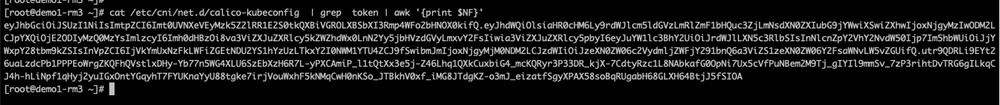
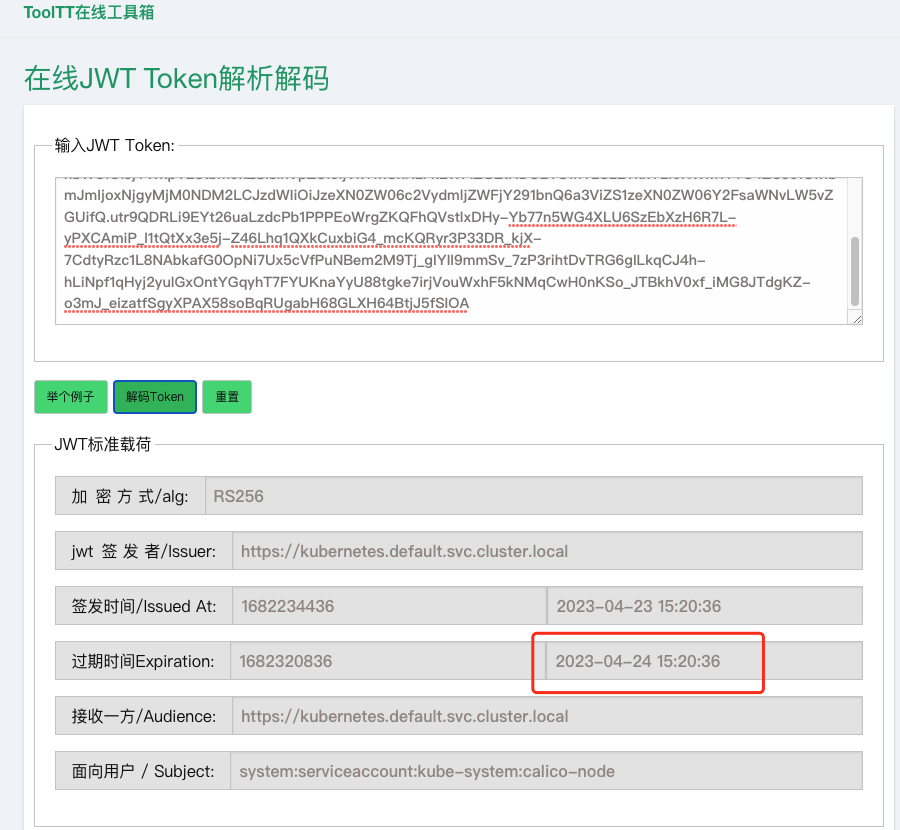

---
kind:
  - Troubleshooting
products:
  - Alauda Container Platform
  - Alauda DevOps
  - Alauda AI
  - Alauda Application Services
  - Alauda Service Mesh
  - Alauda Developer Portal
ProductsVersion:
  - 4.1.0,4.2.x
---
<!-- A type of document that involves encountering a fault, diagnosing it, performing root cause analysis, and providing solutions. -->

# calico集群因calico

pod创建始终处于ContainerCreating状态 Failed to create pod sandbox: rpc error: code = Unknown desc = [failed to set up sandbox container...network: error getting ClusterInformation: connection is unauthorized: Unauthorized]

## Cause
- /etc/cni/net.d/calico-kubeconfig文件中的JWT token过期（有效期1年）且未自动更新
- calico-node组件持续运行超过1年触发该问题

## Resolution
- 将平台升级到3.10或更高版本

## [workaround]
- 部署daemonset-day-check应用自动检测并重启calico-node
- 手动重启所有calico-node pod

## [Related Information]
**Screenshots**

- Environment: 3.6.x, 3.8.x
- /etc/cni/net.d/calico-kubeconfig
- calico-node
- JWT token
- cloud-registry.alauda.cn/acp/calico-check:v3.20.2
- Component: Calico
- Page ID: 140823476
- Original Title: calico集群因calico-kubeconfig 文件超期导致容器创建失败
