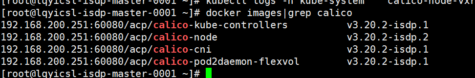
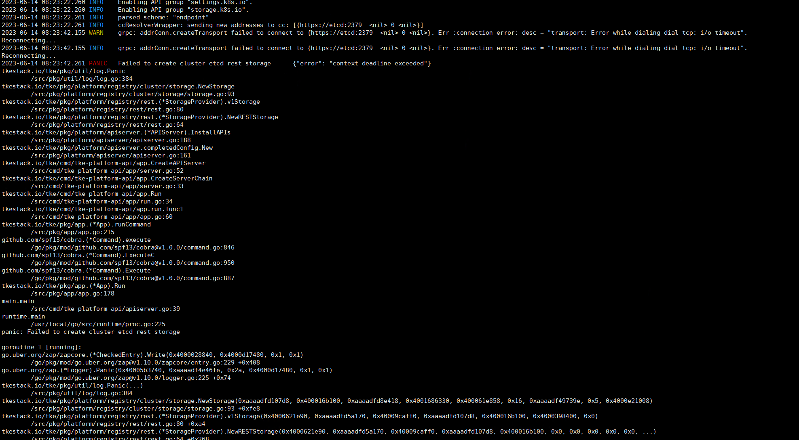
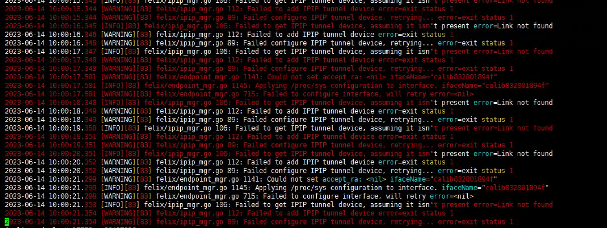
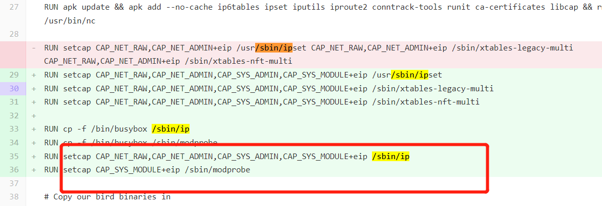

---
kind:
  - Troubleshooting
products:
  - Alauda Container Platform
  - Alauda DevOps
  - Alauda AI
  - Alauda Application Services
  - Alauda Service Mesh
  - Alauda Developer Portal
ProductsVersion:
  - 4.1.0,4.2.x
---
<!-- A type of document that involves encountering a fault, diagnosing it, performing root cause analysis, and providing solutions. -->

# 华为isdp

容器访问etcd:2379失败 host没有pod对应的calic-xxxxxxxxx网卡 tunl0网卡不断被删除重建

## Cause
- calico-node没权限执行ip命令导致无法创建tunl0设备

## Resolution
- 手动添加tunl0网卡: ip tunnel add tunl0 mode ipip
- 重启calico-node
- 应用修复PR: <https://gitlab-ce.alauda.cn/container-platform/calico-node/-/merge_requests/25/diffs>

## [workaround]
- 临时手动添加tunl0网卡: ip tunnel add tunl0 mode ipip

## [Related Information]
**Screenshots**

- Environment: CNI 版本：calico
- etcd:2379
- calico-node
- tunl0
- ip命令权限
- net.ipv4.conf.default.rp_filter
- net.ipv4.conf.all.rp_filter
- Component: Calico
- Page ID: 149613391
- Original Title: 华为isdp-3 安装的时候pod起不来
