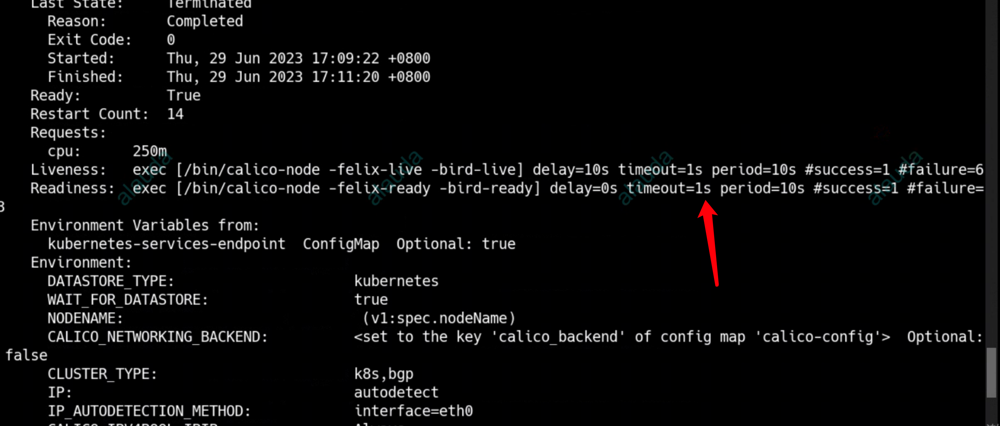

---
kind:
  - Troubleshooting
products:
  - Alauda Container Platform
  - Alauda DevOps
  - Alauda AI
  - Alauda Application Services
  - Alauda Service Mesh
  - Alauda Developer Portal
ProductsVersion:
  - 4.1.0,4.2.x
---
<!-- A type of document that involves encountering a fault, diagnosing it, performing root cause analysis, and providing solutions. -->

# 3.6.2

就绪探测失败 calico-node组件重启

## Cause
- 健康检查超时时间设置为1s
- full-mesh模式下节点较多时偶发健康检查超时

## Resolution
- 调整calico-node健康检查超时时间至5s以上

## [workaround]

## [Related Information]
**Screenshots**

- Environment: 3.6.2
- calico-node就绪探针
- /readiness
- livenessProbe配置
- full-mesh模式
- Component: Calico
- Page ID: 152633826
- Original Title: 3.6.2-容器平台-集群部分节点calico-node组件重启
