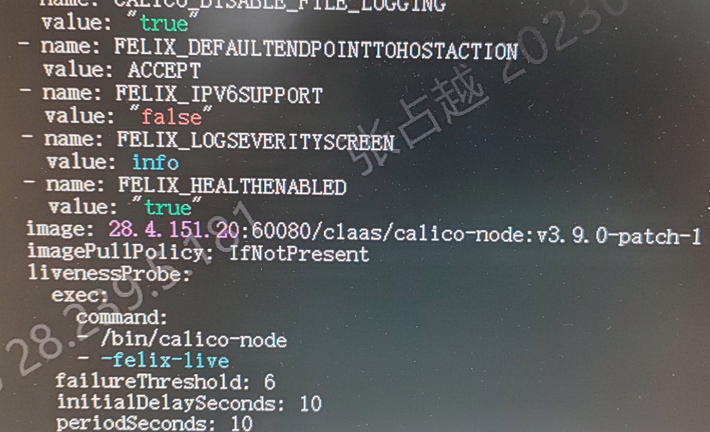
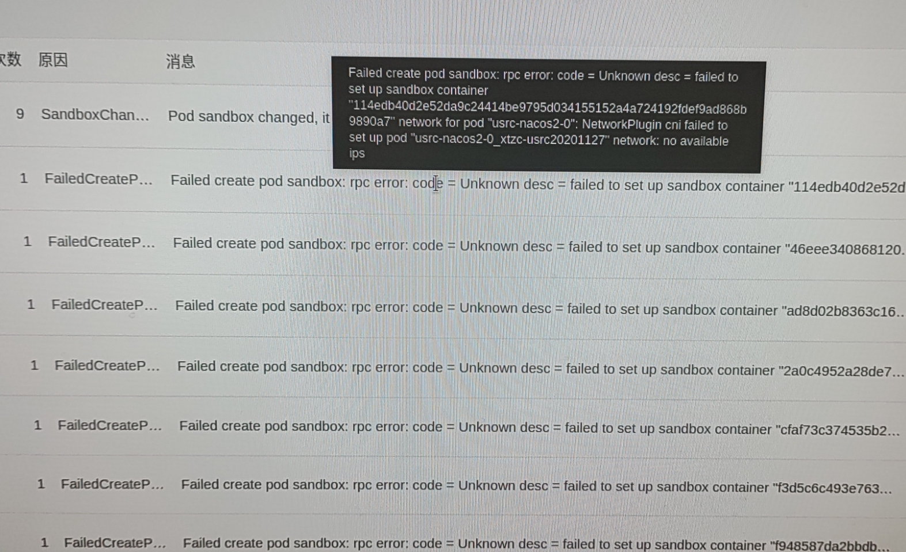
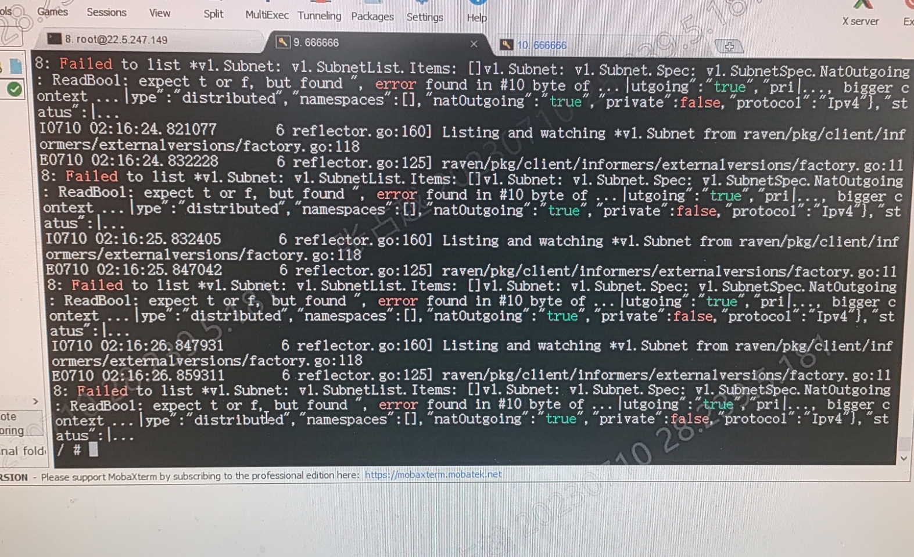
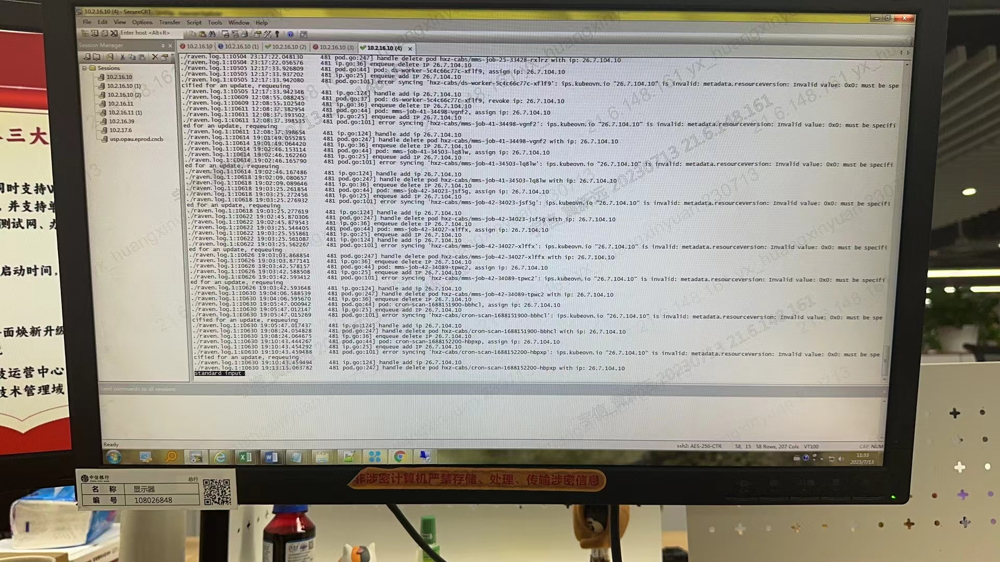

---
kind:
  - Troubleshooting
products:
  - Alauda Container Platform
  - Alauda DevOps
  - Alauda AI
  - Alauda Application Services
  - Alauda Service Mesh
  - Alauda Developer Portal
ProductsVersion:
  - 4.1.0,4.2.x
---
<!-- A type of document that involves encountering a fault, diagnosing it, performing root cause analysis, and providing solutions. -->

# 中信 acp 2.6 calico 问题

calico网络使用固定ip报错 pod删除后ip计数没更新

## Cause

## Resolution
- 检查/var/log/mathilde/raven.log日志文件

## [workaround]

## [Related Information]
**Screenshots**

- Environment: acp 2.6 with calico
- calico
- raven组件
- /var/log/mathilde/raven.log
- /var/log/supervisor/supervisord.log
- Component: Calico
- Page ID: 152653411
- Original Title: 中信 acp 2.6 calico 问题
