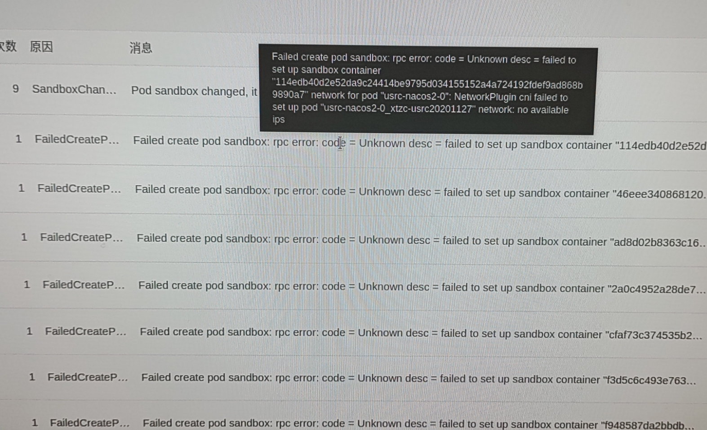
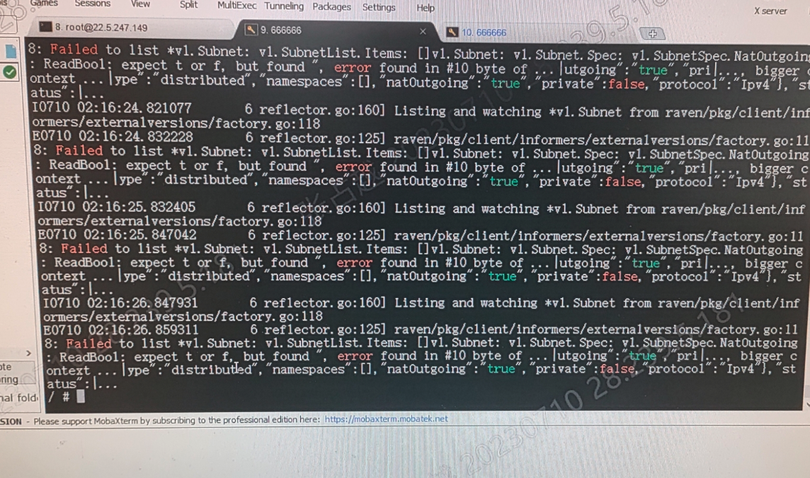
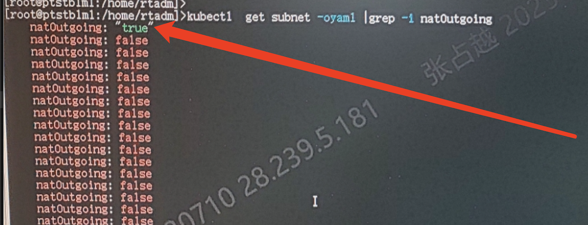

---
kind:
  - Troubleshooting
products:
  - Alauda Container Platform
  - Alauda DevOps
  - Alauda AI
  - Alauda Application Services
  - Alauda Service Mesh
  - Alauda Developer Portal
ProductsVersion:
  - 4.1.0,4.2.x
---
<!-- A type of document that involves encountering a fault, diagnosing it, performing root cause analysis, and providing solutions. -->

# 容器平台2.6

Pod报错没有可以分配的ip 自动分配ip正常

## Cause
- subnet字段配置存在引号导致解析异常

## Resolution
- 去除subnet字段的""号
- 重启raven服务

## [workaround]

## [Related Information]
**Screenshots**

- Environment: 2.6
- raven
- subnet
- /var/log/mathilde/raven.log
- /var/log/supervisor/supervisord.log
- Component: Calico
- Page ID: 152653533
- Original Title: 容器平台2.6-calico网络固定ip报错
