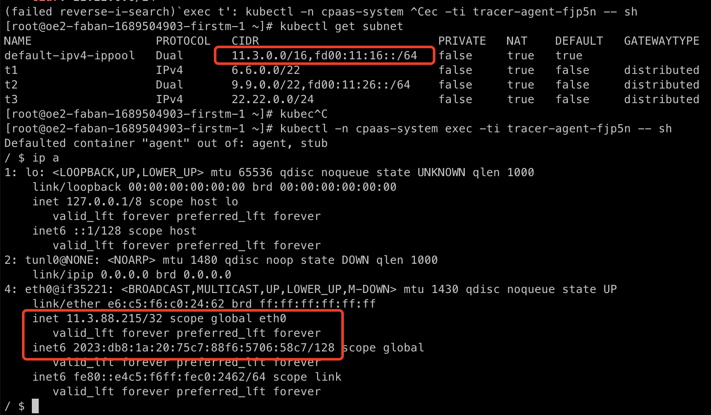

---
kind:
  - Troubleshooting
products:
  - Alauda Container Platform
  - Alauda DevOps
  - Alauda AI
  - Alauda Application Services
  - Alauda Service Mesh
  - Alauda Developer Portal
ProductsVersion:
  - 4.1.0,4.2.x
---
<!-- A type of document that involves encountering a fault, diagnosing it, performing root cause analysis, and providing solutions. -->

# 双栈 Pod 无法通过 IPv6 访问集群外部

Pod 无法通过域名访问集群外部 curl 使用 IPv6 地址访问失败 Pod IPv6 地址不在默认子网网段内

## Cause
- Pod 的 IPv4 和 IPv6 地址分别从不同子网分配
- 测试用子网未正确排除导致 IPv6 地址分配异常

## Resolution
- 删除测试用子网或调整 ippool nodeSelector 排除所有节点
- 手动重建故障 Pod

## [workaround]

## [Related Information]
**Screenshots**

- Environment: Kubernetes, Calico v3.26, ACP v3.12.2
- calico ippool
- Raven 子网映射
- nodeSelector
- Component: Calico
- Page ID: 152661077
- Original Title: 双栈 Pod 无法通过 IPv6 访问集群外部
