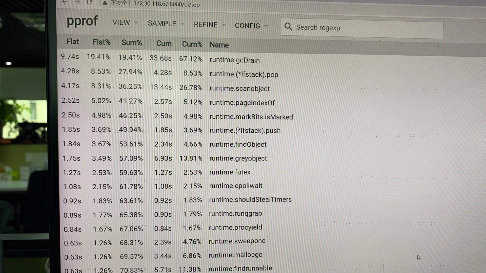

---
kind:
  - Troubleshooting
products:
  - Alauda Container Platform
  - Alauda DevOps
  - Alauda AI
  - Alauda Application Services
  - Alauda Service Mesh
  - Alauda Developer Portal
ProductsVersion:
  - 4.1.0,4.2.x
---
<!-- A type of document that involves encountering a fault, diagnosing it, performing root cause analysis, and providing solutions. -->

# calico

calico-node felix 进程持续占用 ~1000% CPU

## Cause
- Felix 进程的垃圾回收(gc)消耗大量 CPU 资源

## Resolution
- 根据 GitHub issue #4129 对应的 PR 对 calico-node 进行 hotfix

## [workaround]

## [Related Information]
**Screenshots**

- Environment: Calico v3.16, ACP v3.6
- calico-node
- Felix 进程
- Component: Calico
- Page ID: 158335085
- Original Title: calico-node felix 进程消耗大量 CPU
