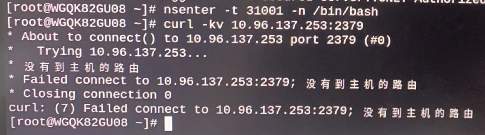
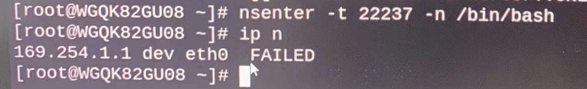
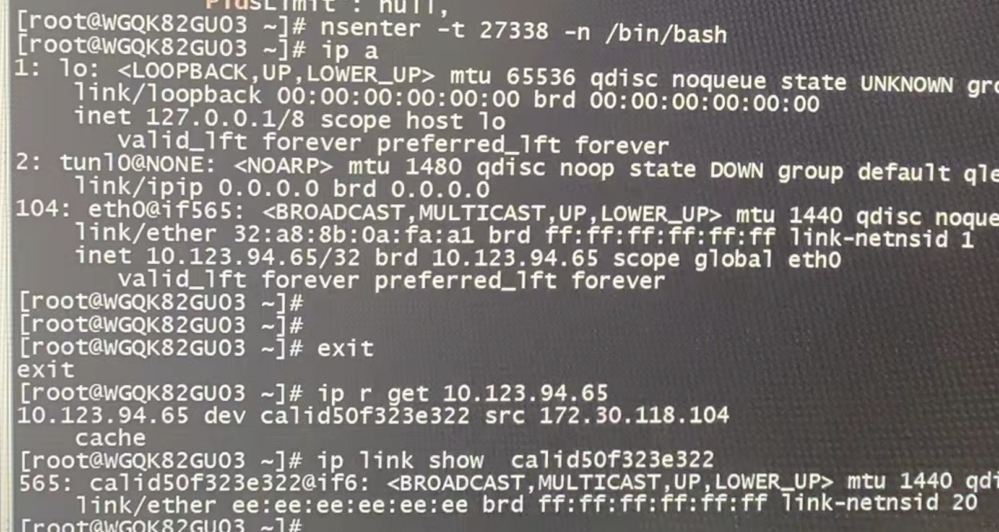
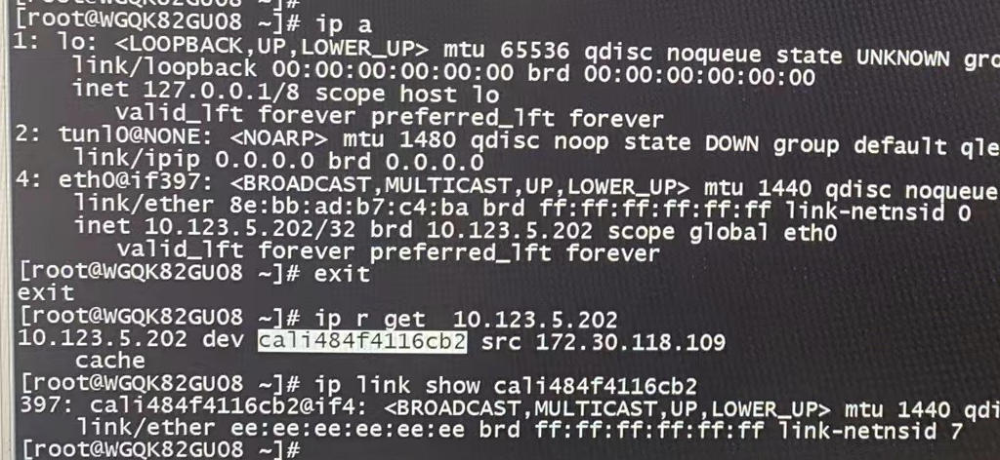

---kind:   - Troubleshootingproducts:    - Alauda Container Platform   - Alauda DevOps   - Alauda AI   - Alauda Application Services   - Alauda Service Mesh   - Alauda Developer PortalProductsVersion:   - 4.1.0,4.2.x---<!-- A type of document that involves encountering a fault, diag...it, performing root cause analysis, and providing solutions. --># Pod 无法与集群任何节点或Pod通信：no route to hostPod无法与集群节点或Pod通信，报错no route to host Pod中arp请求无响应，neighbor状态FAILED Pod的eth0 index为104，节点veth peer index不匹配（如6）## Cause- Pod的eth0与节点veth peer的index不匹配导致网络路径异常## Resolution- 清理ALB相关资源- 重启所有故障节点## [workaround]## [Related Information]**Screenshots**- Environment: centos 7.9, calico v3.16, ACP v3.6- veth设备- arp配置(neigh.default.gc_thresh)- calico- ALB资源- Component: Calico- Page ID: 158335173- Original Title: Pod 无法与集群任何节点或Pod通信：no route to host