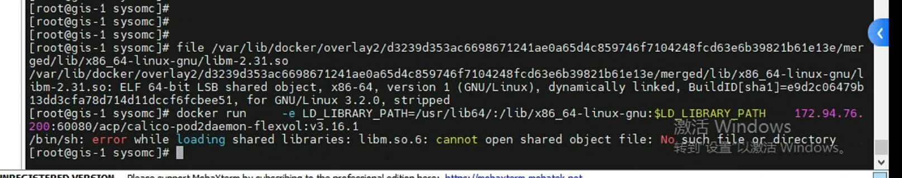
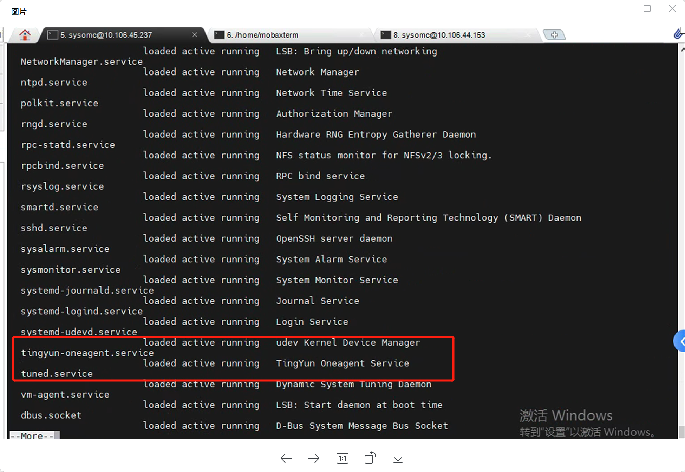

---kind:   - Troubleshootingproducts:    - Alauda Container Platform   - Alauda DevOps   - Alauda AI   - Alauda Application Services   - Alauda Service Mesh   - Alauda Developer PortalProductsVersion:   - 4.1.0,4.2.x---<!-- A type of document that involves encountering a fault, diag...it, performing root cause analysis, and providing solutions. --># 欧拉系统上 某个节点calicocalico-node启动报错库找不到## Cause- 听云agent运行导致冲突## Resolution- 关闭听云agent: systemctl停止相关服务## [workaround]## [Related Information]**Screenshots**- Environment: EulerOS- systemctl- calico-node- 听云agent- Component: Calico- Page ID: 158796448- Original Title: 欧拉系统上 某个节点calico-node启动失败