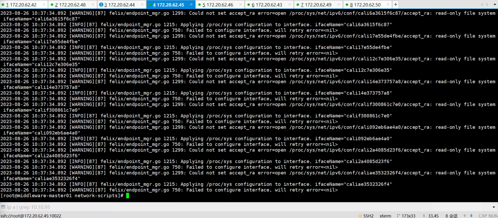
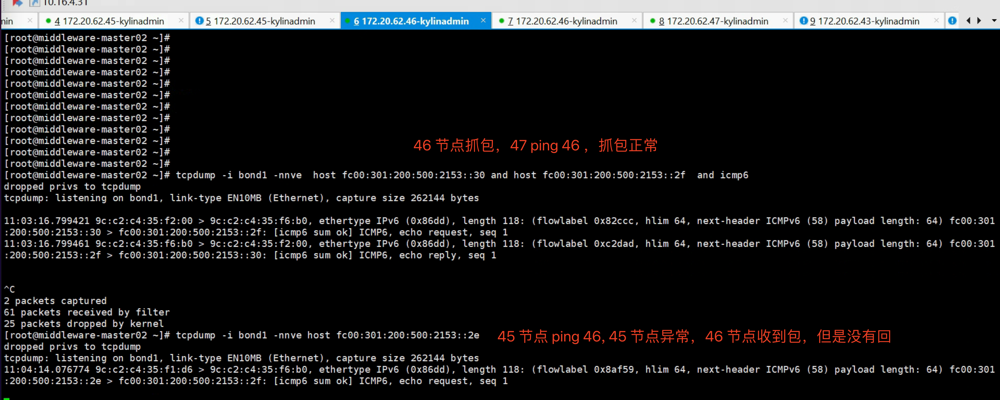
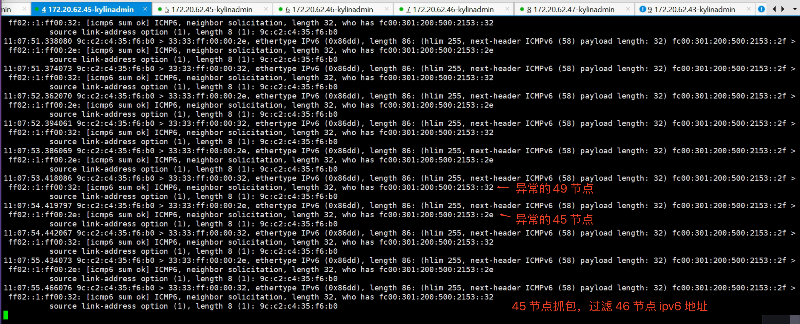
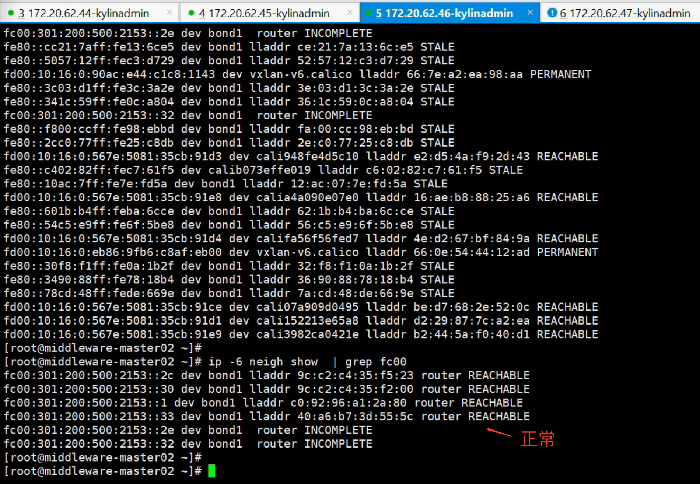
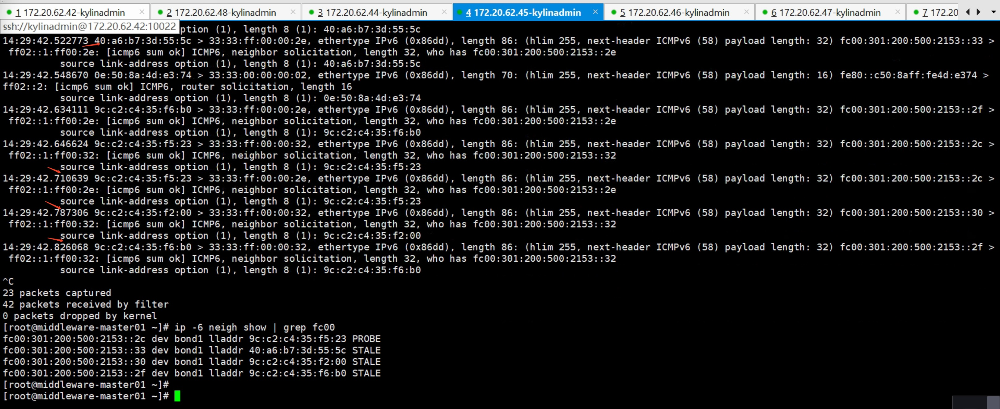
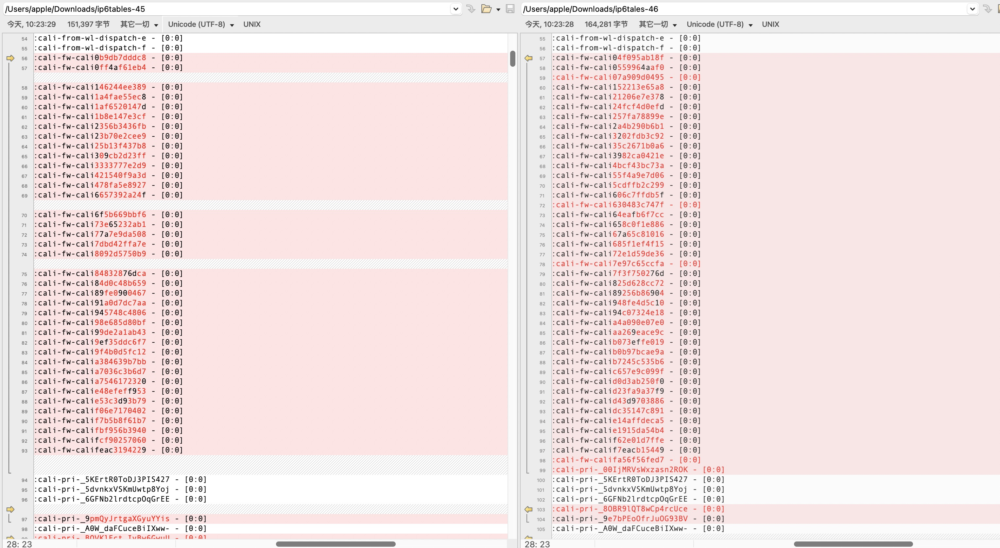
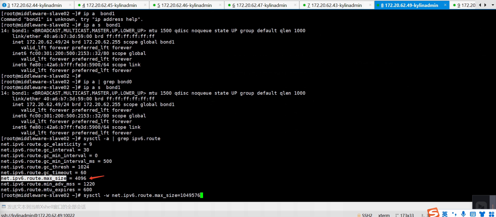

---
kind:
  - Troubleshooting
products:
  - Alauda Container Platform
  - Alauda DevOps
  - Alauda AI
  - Alauda Application Services
  - Alauda Service Mesh
  - Alauda Developer Portal
ProductsVersion:
  - 4.1.0,4.2.x
---
<!-- A type of document that involves encountering a fault, diagnosing it, performing root cause analysis, and providing solutions. -->

# 南网IPv6新集群环境

业务集群节点间网络不通 业务集群与global集群节点间网络不通 业务集群节点无法访问自身bond1网卡IPv6地址

## Cause
- metallb部署后引发网络配置冲突
- kylin-security-daemon安全组件可能干扰
- 节点accept-ra参数未开启
- IPv6路由表限制(net.ipv6.route.max_size过小)

## Resolution
- 调整业务集群节点内核参数：sysctl -w net.ipv6.route.max_size=1048576
- 检查并开启IPv6 accept_ra参数
- 验证calico双栈配置与metallb兼容性

## [workaround]
- 重启业务集群节点临时恢复网络
- 临时重启network服务恢复连接

## [Related Information]
**Screenshots**

- Environment: 操作系统：Kylin；内核：4.19.90；CNI版本：calico v3.26；ACP版本：v3.12.2
- metallb
- calico v3.26
- kylin-security-daemon
- bond1/bond0网卡
- accept_ra参数
- net.ipv6.route.max_size
- Component: Calico
- Page ID: 161386825
- Original Title: 南网IPv6新集群环境
