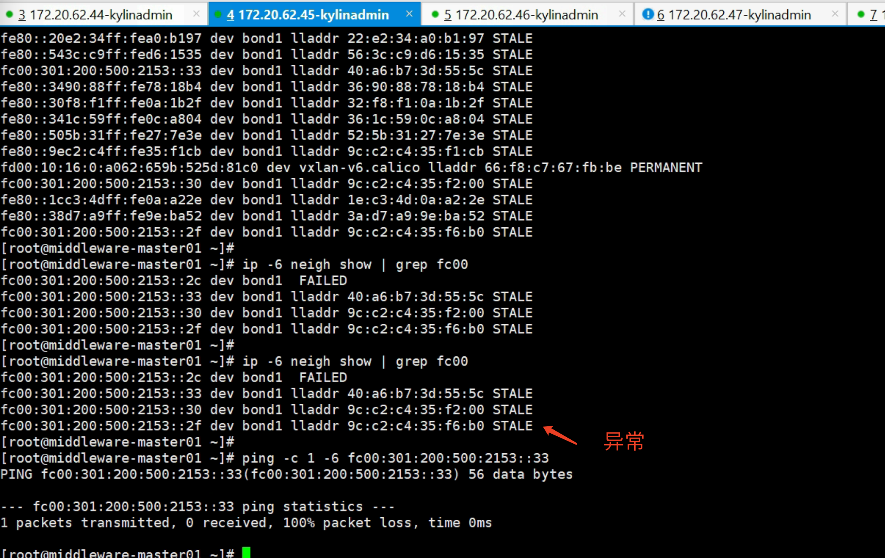
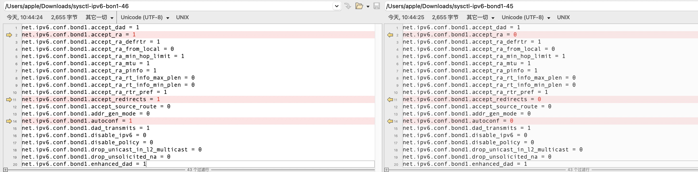

---kind:   - Troubleshootingproducts:    - Alauda Container Platform   - Alauda DevOps   - Alauda AI   - Alauda Application Services   - Alauda Service Mesh   - Alauda Developer PortalProductsVersion:   - 4.1.0,4.2.x---<!-- A type of document that involves encountering a fault, diag...it, performing root cause analysis, and providing solutions. --># 南网IPv6新集群环境业务集群节点间网络不通 业务集群与global集群节点间网络不通 业务集群节点无法访问自身bond1网卡IPv6地址## Cause- kylin-security-daemon可能影响网络- IPv6路由表max_size限制导致丢包- Metallb安装引发双栈配置冲突- accept-ra参数关闭影响IPv6自动配置## Resolution- sysctl -w net.ipv6.route.max_size=1048576- sysctl -w net.ipv6.conf.all.accept_ra=2- 检查Metallb与Calico CIDR配置冲突- 验证kylin-security-daemon对网络的影响## [workaround]- 重启network服务临时恢复- 重启业务集群节点## [Related Information]**Screenshots**- Environment: Kylin 4.19.90, Calico v3.26, ACP v3.12.2- calico- metallb- bond0/bond1- IPv6 CIDR- accept_ra- net.ipv6.route.max_size- kylin-security-daemon- Component: Calico- Page ID: 161386825- Original Title: 南网IPv6新集群环境