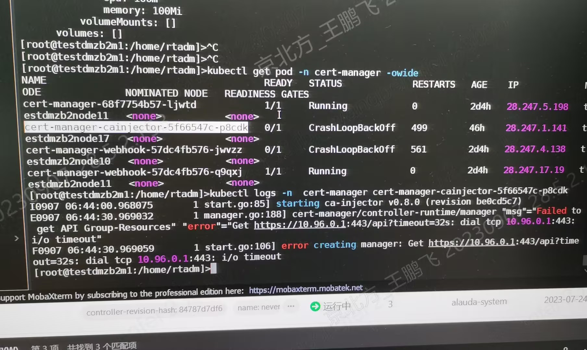
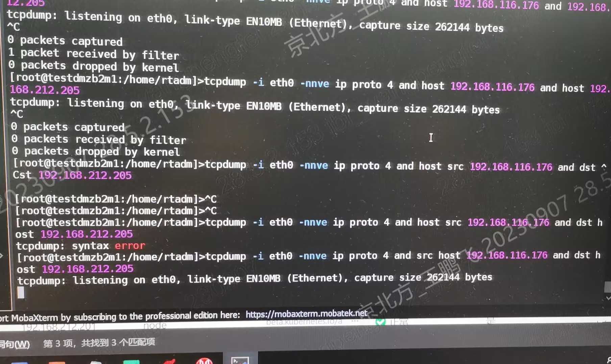
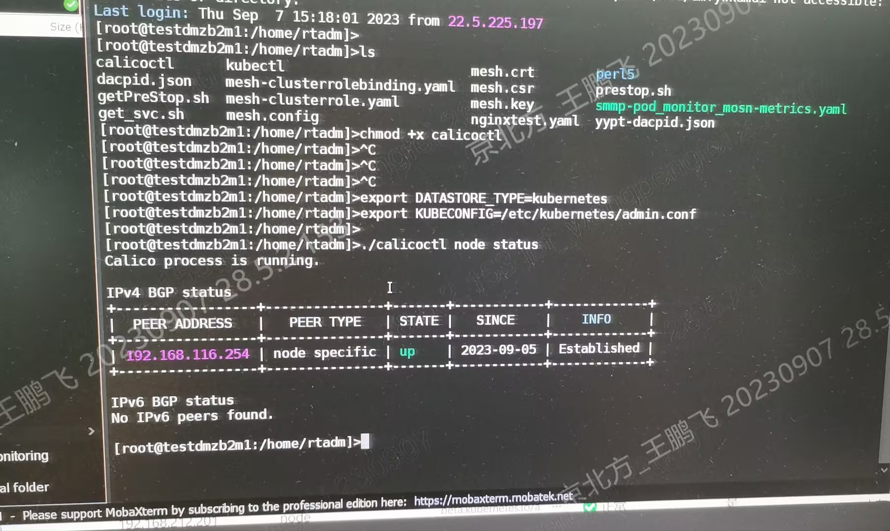
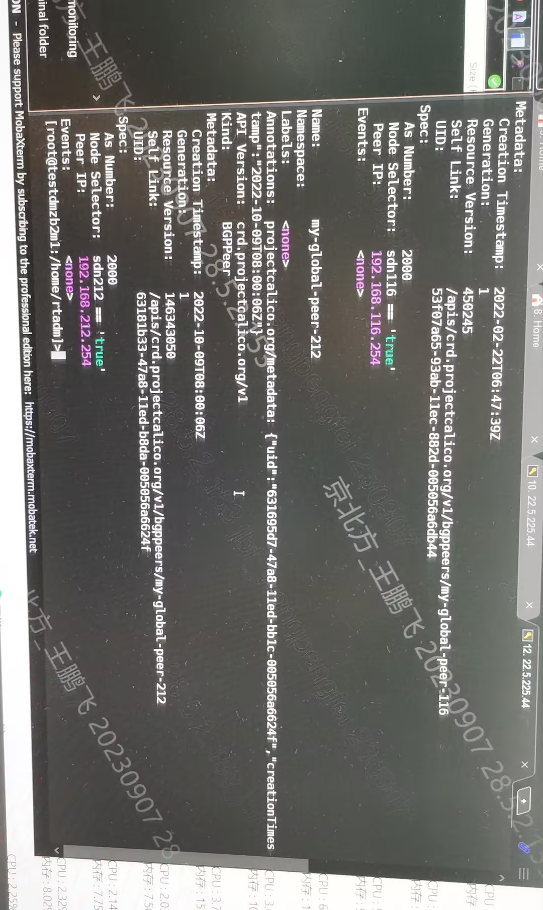

---
kind:
  - Troubleshooting
products:
  - Alauda Container Platform
  - Alauda DevOps
  - Alauda AI
  - Alauda Application Services
  - Alauda Service Mesh
  - Alauda Developer Portal
ProductsVersion:
  - 4.1.0,4.2.x
---
<!-- A type of document that involves encountering a fault, diagnosing it, performing root cause analysis, and providing solutions. -->

# 中信银行calico bgp 环境pod访问api

pod访问api-server不通 master节点无法ping通pod ip traceroute在网关192.168.116.254后中断

## Cause
- 新节点(node10-17)未配置calico节点标签(sdn116/sdn212)
- bgp peer配置依赖节点标签未生效
- 节点bgp服务未启动

## Resolution
- 为新增节点配置对应sdn标签: kubectl label nodes <node> sdn116=true/sdn212=true
- 删除metis服务: kubectl delete deploy,svc -n alauda-system metis
- 重启控制平面组件: docker rm -f kube-apiserver/kube-controller/kube-scheduler容器

## [workaround]

## [Related Information]
**Screenshots**

- Environment: Kubernetes acp 2.6 + Calico BGP
- 179
- sdn116
- sdn212
- metis
- calicoctl
- /etc/kubernetes/admin.conf
- kube-system/raven
- Component: Calico
- Page ID: 163056598
- Original Title: 中信银行calico bgp 环境pod访问api-server不通问题
